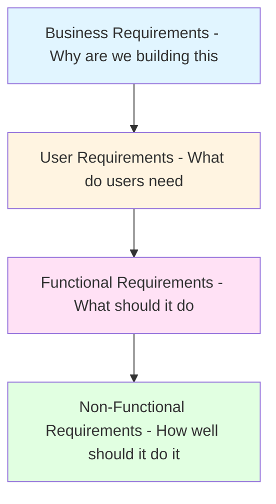
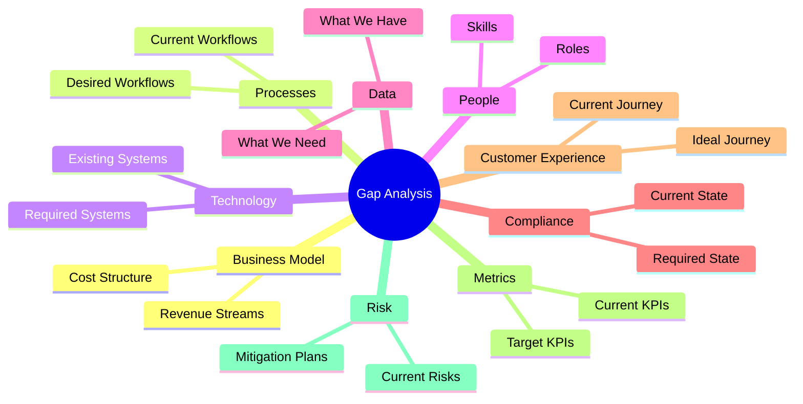
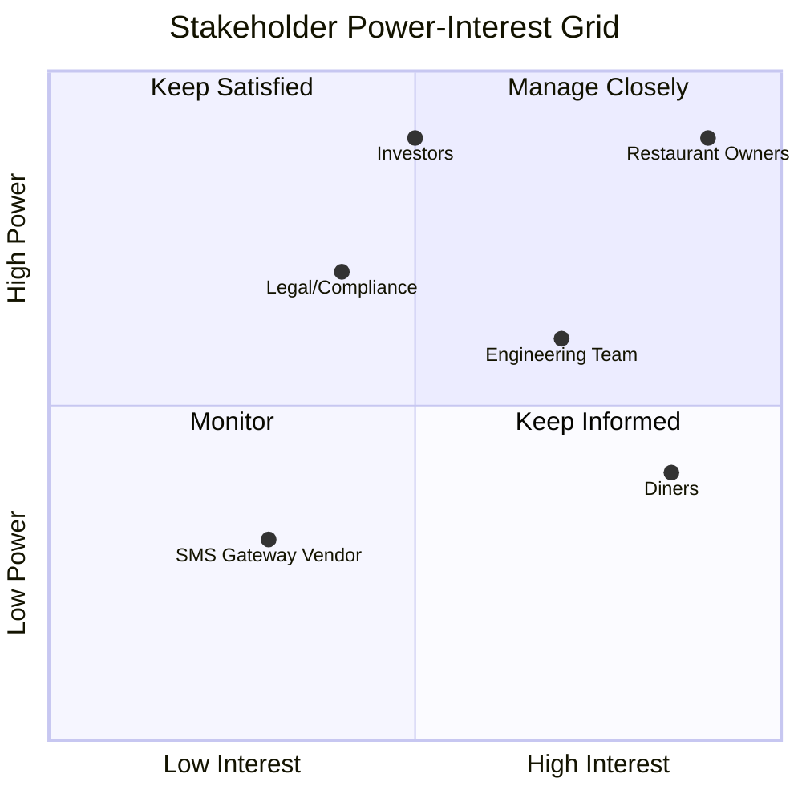

# Module 1: Requirements Engineering

**Duration:** 2 weeks | **Difficulty:** ⭐⭐☆☆☆ | **Prerequisites:** None

## Overview

Requirements Engineering is the foundation of successful product development. It's the systematic process of discovering, documenting, and managing what users need and what the business requires.

**You'll learn:**

- How to gather requirements from stakeholders
- The Requirements Pyramid framework
- 9-Dimension Gap Analysis (As-Is vs To-Be)
- Elicitation techniques that actually work

**ReserveEasy Application:** [Market Analysis](../02-reserve-easy-project/01-discovery/market-analysis.md)

---

## Table of Contents

1. [What Are Requirements?](#what-are-requirements)
2. [The Requirements Pyramid](#the-requirements-pyramid)
3. [9-Dimension Gap Analysis](#9-dimension-gap-analysis)
4. [Elicitation Techniques](#elicitation-techniques)
5. [Stakeholder Analysis](#stakeholder-analysis)
6. [Requirements Documentation](#requirements-documentation)
7. [Common Pitfalls](#common-pitfalls)
8. [Exercises](#exercises)

---

## What Are Requirements?

**Definition:** A requirement is a documented statement of a need that a product must satisfy.

### The Four Levels

Think of requirements as a pyramid - each level builds on the foundation below:

**Example from ReserveEasy:**

| Level              | Requirement                                          | Source          |
| ------------------ | ---------------------------------------------------- | --------------- |
| **Business**       | Increase restaurant revenue per table by 20%         | CFO             |
| **User**           | Diners need guaranteed seating without phone calls   | User interviews |
| **Functional**     | System shall send SMS confirmation within 30 seconds | Product spec    |
| **Non-Functional** | Booking page shall load in < 2 seconds               | Engineering     |

---

## The Requirements Pyramid

This framework ensures you're solving the _right_ problem before jumping to solutions.

### Level 1: Business Requirements

**Ask:** Why are we building this? What business problem are we solving?

**Format:** Business goals, objectives, success metrics

**ReserveEasy Example:**

- **Problem:** Restaurants lose 30% of revenue to no-shows
- **Opportunity:** $X billion market for reservation systems
- **Goal:** Become #1 platform for casual dining reservations
- **Success Metric:** 500 restaurants onboarded in Year 1

**Documentation:** Business Requirements Document (BRD) → [See Template](../03-toolkit/templates/brd-template.md)

---

### Level 2: User Requirements

**Ask:** Who are our users? What jobs are they trying to do?

**Format:** Personas, user stories, jobs-to-be-done

**ReserveEasy Example:**

**Persona: Busy Diner Sarah**

- **Demographics:** 28, marketing professional, city dweller
- **Frustrations:**
  - Calling restaurants wastes 10 minutes
  - No confirmation = anxiety
  - Can't easily modify reservations
- **Jobs to Be Done:** "When I'm planning dinner with friends, I want guaranteed seating so I can avoid embarrassment if we can't get a table."

**Persona: Restaurant Manager Raj**

- **Demographics:** 42, manages 50-seat bistro
- **Frustrations:**
  - 30% no-show rate kills profit margins
  - Phone interruptions during dinner rush
  - No historical data on peak times
- **Jobs to Be Done:** "When managing my floor, I want to maximize table turnover so I can serve more customers and increase revenue."

**Documentation:** [User Personas](../02-reserve-easy-project/01-discovery/user-personas.md)

---

### Level 3: Functional Requirements

**Ask:** What specific features and behaviors must the system have?

**Format:** "The system shall..." statements

**ReserveEasy Examples:**

| ID     | Functional Requirement                                                   | Priority          |
| ------ | ------------------------------------------------------------------------ | ----------------- |
| FR-001 | The system shall display real-time table availability                    | P0 (Must Have)    |
| FR-002 | The system shall send SMS confirmation within 30 seconds of booking      | P0                |
| FR-003 | The system shall allow users to modify reservations up to 2 hours before | P1 (Should Have)  |
| FR-004 | The system shall charge a $10 deposit for parties of 6+                  | P1                |
| FR-005 | The system shall provide a dashboard showing no-show rates               | P2 (Nice to Have) |

**Best Practices:**

- ✅ Use "shall" for mandatory, "should" for optional
- ✅ One requirement per statement
- ✅ Testable and measurable
- ❌ Avoid vague words like "user-friendly" or "fast"

**Documentation:** Functional Specification Document (FSD) → [See Example](../02-reserve-easy-project/02-specs/FSD-booking-mod.md)

---

### Level 4: Non-Functional Requirements (NFRs)

**Ask:** How well should it perform? What are the quality attributes?

**Categories:**

#### Performance

- Page load time < 2 seconds
- API response time < 500ms
- Support 10,000 concurrent users

#### Security

- Data encrypted at rest (AES-256)
- HTTPS only (TLS 1.3)
- PCI DSS compliant for payments

#### Scalability

- Handle 100,000 bookings/day
- Auto-scale during peak hours (6-9 PM)

#### Availability

- 99.9% uptime (< 9 hours downtime/year)
- Graceful degradation if SMS gateway fails

#### Usability

- WCAG 2.1 AA accessibility compliance
- Mobile-responsive (works on screens ≥ 320px)
- Support 5 languages (English, Spanish, French, Italian, German)

**Why NFRs Matter:** A feature that works but is too slow, insecure, or unreliable is useless.

---

##9-Dimension Gap Analysis

This framework compares your **current state** (As-Is) with your **desired state** (To-Be) across nine business dimensions.

### The Nine Dimensions

### ReserveEasy Example: Booking Process

| Dimension               | As-Is (Current State)                                       | To-Be (Desired State)                                     | Gap                              |
| ----------------------- | ----------------------------------------------------------- | --------------------------------------------------------- | -------------------------------- |
| **Process**             | Customer calls, waits on hold average 5 min, books verbally | Customer books online in 60 seconds                       | Automation of booking workflow   |
| **Technology**          | Phone system, paper reservation book                        | Web app, mobile app, cloud database                       | Build/buy reservation platform   |
| **Data**                | No booking history, scattered across notebooks              | Centralized database, historical analytics                | Data infrastructure + migration  |
| **Metrics**             | 30% no-show rate, no tracking of cancellations              | <5% no-show rate, real-time dashboard                     | Tracking system + deposit policy |
| **People**              | Host manages all reservations manually                      | Host focuses on guest experience, system handles bookings | Training on new system           |
| **Customer Experience** | Frustration: long wait times, no confirmation               | Instant confirmation, easy modification                   | UX design + SMS integration      |
| **Business Model**      | No monetization of reservations                             | Commission on completed bookings                          | Payment processing integration   |
| **Compliance**          | GDPR unclear, no data policy                                | GDPR compliant, privacy policy public                     | Legal review + policy docs       |
| **Risk**                | Double-bookings common (10% of reservations)                | Impossible due to real-time availability                  | Concurrency handling in DB       |

**Outcome:** This analysis shows we need to build 7 major capabilities to close the gaps.

**See Full Example:** [ReserveEasy Gap Analysis](../02-reserve-easy-project/01-discovery/market-analysis.md)

---

## Elicitation Techniques

**Elicitation** = the process of gathering requirements from stakeholders.

### 1. Stakeholder Interviews

**When to Use:** Early discovery, understanding business context

**Best Practices:**

- **Prepare:** Research the person's role, review existing docs
- **Ask open-ended questions:** "Tell me about your typical day" not "Do you like the current system?"
- **Listen more than you talk:** 80/20 rule
- **Follow up on emotion:** "You sounded frustrated when you mentioned X - tell me more"

**Sample Questions for ReserveEasy:**

_For Restaurant Owners:_

- "Walk me through what happens when someone calls to make a reservation."
- "What percentage of your reservations are no-shows? How do you handle that?"
- "If you could wave a magic wand, what would the ideal booking process look like?"

_For Diners:_

- "Think back to the last time you made a restaurant reservation. How did that go?"
- "Have you ever shown up to a restaurant and they didn't have your reservation? What happened?"
- "What would make you more likely to book through an app vs calling?"

---

### 2. Workshops & Brainstorms

**When to Use:** Multiple stakeholders, need alignment on priorities

**Techniques:**

- **User Story Mapping:** Visual exercise to build a backlog collaboratively
- **"How Might We" Questions:** Turn problems into opportunities ("HMW reduce no-shows?")
- **Rose/Thorn/Bud:** What's working (rose), what's not (thorn), what's emerging (bud)

**Example Workshop Agenda (2 hours):**

1. **0:00-0:15** - Intros, workshop goals, ground rules
2. **0:15-0:45** - User journey mapping (sticky notes on wall)
3. **0:45-1:00** - Identify pain points (red dots on journey)
4. **1:00-1:30** - "How Might We" ideation
5. **1:30-1:50** - Dot voting on priorities
6. **1:50-2:00** - Next steps, owners, timeline

---

### 3. Observation (Job Shadowing)

**When to Use:** Understanding current workflows, finding hidden pain points

**Example:** Spend 3 hours shadowing a restaurant host during dinner rush.

**What to Notice:**

- How many phone calls interrupt them?
- Do they use a computer or paper book?
- How do they handle conflicts (double-bookings)?
- What questions do customers ask?

**Insight:** We discovered hosts get interrupted every 4 minutes during peak hours - a calculator of why they want automation!

---

### 4. Surveys & Questionnaires

**When to Use:** Large sample size, quantitative validation

**Good For:**

- Feature prioritization (rank 1-5: How important is SMS confirmation?)
- Pain point validation (What % rate no-shows as a major problem?)
- Willingness to pay (Would you pay $0.50 per booking for this service?)

**Sample Question:**

> **How often do you make restaurant reservations?**
>
> - [ ] Daily
> - [ ] Weekly
> - [ ] Monthly
> - [ ] A few times per year
> - [ ] Never
>
> _If "Never," skip to Q15_

---

### 5. Competitive Analysis

**When to Use:** Understanding market baseline, avoiding reinventing the wheel

**ReserveEasy Competitors:**

- **OpenTable:** Market leader, focuses on high-end dining
- **Resy:** Trendy, mobile-first, limited deposit options
- **Yelp Reservations:** Free for restaurants, basic features

**Analysis Framework:**

| Feature                | OpenTable | Resy    | Yelp | Us (Gap?)                 |
| ---------------------- | --------- | ------- | ---- | ------------------------- |
| Real-time availability | ✅        | ✅      | ✅   | Must have                 |
| SMS confirmation       | ✅        | ✅      | ❌   | Differentiator            |
| Deposit system         | ❌        | Limited | ❌   | Our advantage             |
| Commission             | 15-20%    | 10-15%  | Free | TBD (competitive pricing) |

---

## Stakeholder Analysis

Not all stakeholders are equal. Use the **Power-Interest Grid** to prioritize engagement.

**Strategy by Quadrant:**

| Quadrant                                       | Stakeholders                 | Strategy                                      |
| ---------------------------------------------- | ---------------------------- | --------------------------------------------- |
| **Manage Closely** (High Power, High Interest) | Restaurant owners, Investors | Weekly updates, deep involvement in decisions |
| **Keep Satisfied** (High Power, Low Interest)  | CFO, Legal                   | Monthly summaries, escalate only major issues |
| **Keep Informed** (Low Power, High Interest)   | Diners, Engineering team     | Regular newsletters, public roadmap           |
| **Monitor** (Low Power, Low Interest)          | SMS vendor                   | Standard communication, no special treatment  |

---

## Requirements Documentation

### Business Requirements Document (BRD)

**Purpose:** Communicate business justification and high-level scope to executives and stakeholders.

**Key Sections:**

1. Executive Summary (1 page)
2. Business Objectives
3. Stakeholder Analysis
4. Scope (In-Scope vs Out-of-Scope)
5. Success Criteria
6. Assumptions & Constraints
7. Risks

**Template:** [BRD Template](../03-toolkit/templates/brd-template.md)

**Example:** [ReserveEasy BRD](../02-reserve-easy-project/02-specs/BRD-v1.0.md)

---

### Functional Specification Document (FSD)

**Purpose:** Detailed blueprint for engineering on how features should work.

**Key Sections:**

1. Feature Overview
2. User Stories
3. Functional Requirements (shall statements)
4. Business Rules
5. UI/UX Mockups
6. Data Model
7. Error Handling
8. Acceptance Criteria

**Example:** [Booking Modification FSD](../02-reserve-easy-project/02-specs/FSD-booking-mod.md)

---

## Common Pitfalls

### ❌ Pitfall #1: Solutionizing Too Early

**Problem:** Stakeholders say "We need a mobile app" instead of "I need to book tables on-the-go."

**Fix:** Ask "Why?" 5 times to get to the root need.

**Example:**

- Stakeholder: "We need a mobile app."
- You: "Why?"
- Stakeholder: "Because customers want to book on their phones."
- You: "Why do they want to book on their phones?"
- Stakeholder: "Because they research restaurants while commuting."
- You: "Why not use the website on mobile?"
- Stakeholder: "It's not mobile-optimized."
- **Aha!** The requirement is a mobile-responsive website, not necessarily a native app.

---

### ❌ Pitfall #2: Ambiguous Requirements

**Bad:** "The system should be fast."

**Good:** "The booking confirmation page shall load in < 2 seconds on a 4G connection."

**Rule:** If you can't test it, it's not a requirement.

---

### ❌ Pitfall #3: Ignoring Non-Functional Requirements

**What Happens:** You build a feature that works but:

- Takes 30 seconds to load (performance)
- Crashes with >100 users (scalability)
- Exposes user data (security)

**Fix:** Define NFRs upfront and get engineering sign-off on feasibility.

---

### ❌ Pitfall #4: Scope Creep

**Problem:** "While we're at it, can we also add loyalty points?"

**Fix:**

- Maintain a "Scope Log" - track all new requests
- Evaluate against original business objectives
- Say "Great idea! Let's add to V2 backlog" (not "No")

---

## Exercises

### Exercise 1: Requirements Pyramid for Your Product Pick a product you use daily (e.g., Spotify, Uber, Netflix).

**Tasks:**

1. Write 1 business requirement
2. Write 2 user requirements (2 personas)
3. Write 5 functional requirements
4. Write 3 non-functional requirements

---

### Exercise 2: Gap Analysis for ReserveEasy

Using the 9-Dimension framework, complete the gap analysis for **Payment Processing**:

| Dimension  | As-Is | To-Be | Gap |
| ---------- | ----- | ----- | --- |
| Process    | ?     | ?     | ?   |
| Technology | ?     | ?     | ?   |
| Data       | ?     | ?     | ?   |

---

### Exercise 3: Conduct a Mock Interview

Find a friend who works in a restaurant (or any service business). Interview them for 30 minutes using the techniques from this module. Document:

- 3 pain points you discovered
- 2 functional requirements that would address them
- 1 non-functional requirement

---

## Key Takeaways

✅ Requirements engineering is about understanding the **problem** before jumping to **solutions**

✅ The Requirements Pyramid ensures alignment from business goals → user needs → technical specs

✅ The 9-Dimension Gap Analysis identifies exactly what needs to be built/changed

✅ Elicitation is a skill - practice active listening and asking "Why?"

✅ Documentation (BRD, FSD) ensures everyone is aligned before development starts

---

## Next Steps

📖 **Read Next:** [Module 2: Agile Execution](02-agile-execution.md)

🏗️ **Apply:** Review the [ReserveEasy Gap Analysis](../02-reserve-easy-project/01-discovery/market-analysis.md)

🛠️ **Practice:** Use the [BRD Template](../03-toolkit/templates/brd-template.md) for your own product idea

---

[← Back to Curriculum](README.md) | [Next Module: Agile Execution →](02-agile-execution.md)
