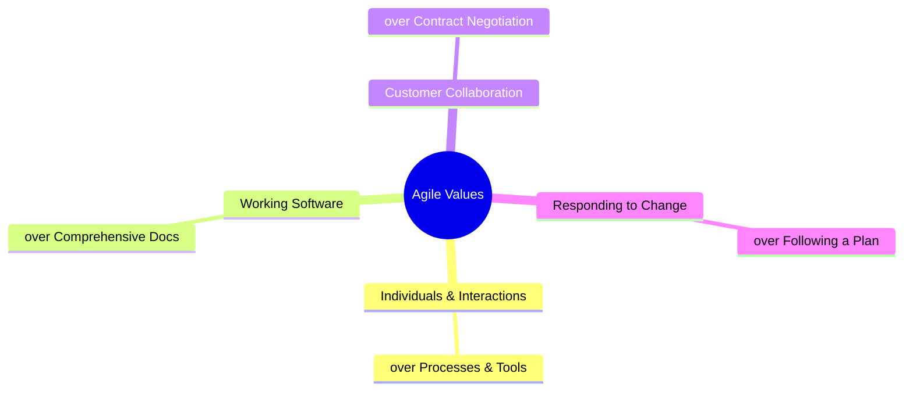
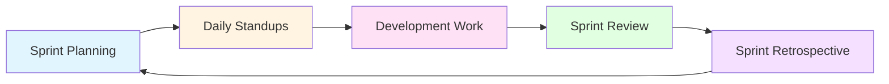

# Module 2: Agile Execution

**Duration:** 2 weeks | **Difficulty:** ⭐⭐⭐☆☆ | **Prerequisites:** Module 1

## Overview

Agile is how modern tech companies ship products. This module teaches you the **practical skills** to execute in Scrum/Agile environments - not just theory, but how to actually write user stories, estimate effort, and prioritize backlogs.

**You'll learn:**

- User story writing with INVEST criteria
- Story point estimation (Planning Poker, Fibonacci)
- Backlog prioritization frameworks (MoSCoW, RICE, WSJF)
- Sprint planning and velocity

**ReserveEasy Application:** [Product Backlog](../02-reserve-easy-project/04-delivery/product-backlog.md)

---

## Table of Contents

1. [What Is Agile?](#what-is-agile)
2. [User Stories](#user-stories)
3. [The INVEST Criteria](#the-invest-criteria)
4. [Story Point Estimation](#story-point-estimation)
5. [Prioritization Frameworks](#prioritization-frameworks)
6. [Backlog Management](#backlog-management)
7. [Sprint Mechanics](#sprint-mechanics)
8. [Exercises](#exercises)

---

## What Is Agile?

**Agile is NOT:**

- ❌ A methodology (it's a mindset)
- ❌ An excuse to skip documentation
- ❌ "WeFigure it out as we go"

**Agile IS:**

- ✅ Iterative delivery (ship small, learn, adapt)
- ✅ Customer collaboration over contract negotiation
- ✅ Responding to change over following a rigid plan

### The Agile Manifesto (2001)



**What This Means for ReserveEasy:**

- Release MVP with 5 core features, not wait for 50
- Get feedback from 10 restaurants before building v2
- Pivot from waitlist to reservations based on user research
- Weekly demos, not 6-month Big Bang launch

---

## User Stories

**Definition:** A user story is a short, simple description of a feature from the perspective of the person who desires the capability (usually a user or customer).

### The Standard Format

```
As a [type of user],
I want [goal/desire],
So that [benefit/value].
```

**Why this format?**

- **"As a"** forces you to think about WHO you're building for
- **"I want"** describes the WHAT (the feature)
- **"So that"** explains the WHY (the value/business justification)

---

### ReserveEasy Examples

#### ✅ Good User Story

```
**Story:** As a diner,
I want to receive SMS confirmation immediately after booking,
So that I have proof of my reservation and peace of mind.

**Acceptance Criteria:**
- GIVEN I complete a booking
- WHEN the payment is processed
- THEN I receive an SMS within 30 seconds
- AND the SMS includes restaurant name, date, time, party size, confirmation code
- AND there is a link to modify the reservation
```

**Why it's good:**

- Clear persona (diner)
- Specific desire (SMS confirmation)
- Measurable outcome (within 30 seconds)
- Testable acceptance criteria

---

#### ❌ Bad User Story #1: Too Technical

```
**Story:** As a user,
I want the booking service to call the SMS API via webhook,
So that notifications are sent asynchronously.
```

**What's wrong:**

- "User" doesn't care about APIs or webhooks
- This is a **technical implementation detail**, not a user need
- Should be rewritten from the user's perspective

**Fixed:**

```
**Story:** As a diner,
I want to receive instant booking confirmation,
So that I don't have to wait wondering if my reservation went through.

**Technical Note (for developers):**
Implementation should use async SMS webhook to avoid blocking the booking flow.
```

---

#### ❌ Bad User Story #2: Too Vague

```
**Story:** As a restaurant manager,
I want better reporting,
So that I can make decisions.
```

**What's wrong:**

- "Better" is subjective
- "Reporting" on what?
- "Decisions" about what?
- Not testable

**Fixed:**

```
**Story:** As a restaurant manager,
I want to see my no-show rate by day of week,
So that I can adjust my overbooking strategy for high-risk nights (e.g., Saturday).

**Acceptance Criteria:**
- GIVEN I navigate to Analytics Dashboard
- WHEN I select "No-Show Analysis"
- THEN I see a chart showing % no-shows for Mon-Sun over the last 3 months
- AND I can export the data as CSV
```

---

## The INVEST Criteria

A checklist to evaluate if your user story is ready for development.

| Letter | Meaning         | What It Means                                       | ReserveEasy Example                                                                  |
| ------ | --------------- | --------------------------------------------------- | ------------------------------------------------------------------------------------ |
| **I**  | **Independent** | Can be developed in any order, no hard dependencies | "Send SMS confirmation" doesn't depend on "Add loyalty points"                       |
| **N**  | **Negotiable**  | Details can be discussed; not a contract            | SMS sent within "30 seconds" vs "immediately" - negotiable based on tech constraints |
| **V**  | **Valuable**    | Delivers clear value to users or business           | Reduces customer anxiety → fewer support calls                                       |
| **E**  | **Estimable**   | Team can estimate the effort                        | Eng team says "5 points" (manageable)                                                |
| **S**  | **Small**       | Can fit in one sprint (1-2 weeks)                   | Yes - can build/test/deploy in one sprint                                            |
| **T**  | **Testable**    | Has clear pass/fail criteria                        | Test: Book reservation → Check SMS arrives within 30s                                |

---

### When a Story Violates INVEST

**Example: Epic Disguised as a Story**

```
**Story:** As a diner, I want a mobile app so I can book on the go.
```

**Problems:**

- ❌ **Not Small:** "Mobile app" is months of work
- ❌ **Not Estimable:** Too big to estimate accurately
- ❌ **Not Independent:** Requires backend APIs, design system, app store setup

**Solution: Break into Smaller Stories**

```
Epic: Mobile App
├── Story 1: As a diner, I want to search restaurants on mobile web, so I can browse options while commuting
├── Story 2: As a diner, I want to complete a booking on mobile without zooming, so the process is smooth
├── Story 3: As a diner, I want to save payment info on mobile, so I don't retype my card each time
├── Story 4: As a diner, I want a native iOS app, so I can use Face ID for faster checkout
└── Story 5: As a diner, I want a native Android app, so I can book on my Samsung phone
```

Now each story is **small** and **independent**.

---

## Story Point Estimation

**Story Points:** A unit of measure for expressing the overall effort required to implement a user story.

**What Points Estimate:**

- Complexity (how hard is it?)
- Amount of work (how much code/testing?)
- Uncertainty/risk (do we know how to do this?)

**What Points DO NOT Estimate:**

- ❌ Actual hours/days
- ❌ Calendar time (a 5-point story doesn't mean 5 days)

---

### The Fibonacci Sequence

Most teams use: **1, 2, 3, 5, 8, 13, 21**

**Why Fibonacci?**

- Reflects increasing uncertainty (the gap between 13 and 21 is bigger than between 1 and 2)
- Forces hard choices (can't say "4" - is it a 3 or 5?)

**Calibration Examples:**

| Points | Complexity                     | Example from ReserveEasy                                      |
| ------ | ------------------------------ | ------------------------------------------------------------- |
| **1**  | Trivial, well-understood       | Change button text from "Book" to "Reserve"                   |
| **2**  | Simple, straightforward        | Add a new field to booking form (e.g., "Special Requests")    |
| **3**  | Typical story                  | Display restaurant hours on search results                    |
| **5**  | Moderate complexity            | Send SMS confirmation (requires SMS gateway integration)      |
| **8**  | Complex, some unknowns         | Implement deposit system (payment processing, refund logic)   |
| **13** | Very complex, lots of unknowns | Multi-party bookings (coordinate 3 groups into 1 reservation) |
| **21** | Epic, needs to be broken down  | Build entire mobile app                                       |

**Rule of Thumb:** If a story is >8 points, break it down into smaller stories.

---

### Planning Poker (Estimation Technique)

**How It Works:**

1. **Read the story aloud** (Product Owner explains)
2. **Ask clarifying questions** (Team asks, PO answers)
3. **Silent individual estimation** (Each person picks a card: 1, 2, 3, 5, 8, 13, 21)
4. **Reveal simultaneously** (Everyone shows their card at once)
5. **Discuss outliers** (If someone said 2 and someone said 13, discuss why)
6. **Re-estimate** (Repeat until consensus)

**Example Discussion:**

> **Story:** As a diner, I want to modify my reservation time, so I can adjust if my plans change.
>
> **Estimate Round 1:**
>
> - Alice (Frontend): 3
> - Bob (Backend): 8
> - Carol (QA): 5
>
> **Discussion:**
>
> - Bob: "I said 8 because we need to check table availability in real-time, handle conflicts, and send updated SMS."
> - Alice: "Oh, I only thought about the UI form. Didn't realize backend was complex."
> - Carol: "Testing will be tricky - need to test edge cases like modifying 1 minute before reservation."
>
> **Estimate Round 2:** Everyone agrees on **8 points**.

---

## Prioritization Frameworks

You can't build everything. Prioritization is about choosing what to build **first**.

---

### 1. MoSCoW

Categorize features into 4 buckets:

- **Must Have:** Non-negotiable for launch
- **Should Have:** Important but not critical
- **Could Have:** Nice to have if time permits
- **Won't Have (this time):** Out of scope for this release

**ReserveEasy MVP Example:**

| Feature                       | Category    | Rationale                                  |
| ----------------------------- | ----------- | ------------------------------------------ |
| Search restaurants by cuisine | Must Have   | Core value prop                            |
| Real-time availability        | Must Have   | Without this, it's just a directory        |
| SMS confirmation              | Must Have   | Reduces no-shows (key business goal)       |
| User accounts                 | Should Have | Can book as guest initially                |
| Loyalty points                | Could Have  | Nice but not essential for MVP             |
| Restaurant reviews            | Won't Have  | Focus on bookings first, add reviews in v2 |

---

### 2. RICE Score

More quantitative than MoSCoW. Calculate a score for each feature:

**Formula:** `RICE = (Reach × Impact × Confidence) / Effort`

| Component      | Definition                                | Scale                                        |
| -------------- | ----------------------------------------- | -------------------------------------------- |
| **Reach**      | How many users affected per quarter?      | Number (e.g., 1000 users)                    |
| **Impact**     | How much does it move the needle?         | 3 = Massive, 2 = High, 1 = Medium, 0.5 = Low |
| **Confidence** | How sure are you about R and I estimates? | 100% = High, 80% = Medium, 50% = Low         |
| **Effort**     | Person-months required                    | Number (e.g., 0.5 = 2 person-weeks)          |

**Example: SMS Confirmation Feature**

- **Reach:** 1,000 bookings/month
- **Impact:** 3 (Massive - directly reduces no-shows)
- **Confidence:** 100% (we've validated this with users)
- **Effort:** 1 person-month

**RICE Score:** `(1000 × 3 × 1.0) / 1 = 3000`

**Example: Dark Mode**

- **Reach:** 500 users/month (not everyone cares)
- **Impact:** 0.5 (Low - nice UX improvement but doesn't affect core metrics)
- **Confidence:** 80% (some users requested it, but small sample)
- **Effort:** 0.5 person-months

**RICE Score:** `(500 × 0.5 × 0.8) / 0.5 = 400`

**Decision:** Prioritize SMS Confirmation (3000) over Dark Mode (400).

---

### 3. WSJF (Weighted Shortest Job First)

Popular in SAFe (Scaled Agile Framework). Prioritize based on **Cost of Delay**.

**Formula:** `WSJF = Cost of Delay / Job Duration`

**Cost of Delay includes:**

- **User/Business Value:** How much value do we gain?
- **Time Criticality:** How time-sensitive is this?
- **Risk Reduction/Opportunity:** Does this unlock other work?

**Scale for each component:** 1 (Low), 2 (Medium), 3 (High)

**Example:**

| Feature             | User Value | Time Criticality      | Risk Reduction           | Job Duration | WSJF                  |
| ------------------- | ---------- | --------------------- | ------------------------ | ------------ | --------------------- |
| SMS Confirmation    | 3          | 3 (Needed for launch) | 2                        | 3 weeks      | (3+3+2)/3 = **2.67**  |
| Analytics Dashboard | 2          | 1 (Can wait)          | 1                        | 4 weeks      | (2+1+1)/4 = **1.0**   |
| Mobile App          | 3          | 2                     | 3 (Unlocks mobile users) | 12 weeks     | (3+2+3)/12 = **0.67** |

**Decision:** Build SMS first (2.67), then Dashboard (1.0), delay Mobile App (0.67).

---

## Backlog Management

The **Product Backlog** is a prioritized list of everything that might be needed in the product.

### Anatomy of a Healthy Backlog

```
Product Backlog
├── Now (Next Sprint) - READY
│   ├── Story 1 (8 points) - Fully defined, estimated, dependencies clear
│   ├── Story 2 (5 points)
│   └── Story 3 (3 points)
├── Next (2-3 Sprints) - REFINED
│   ├── Story 4 (5 points) - High-level defined, rough estimates
│   ├── Story 5 (8 points)
│   └── Epic 1 (needs breakdown)
├── Later (Future) - IDEAS
│   ├── Epic 2
│   ├── Feature Request from Customer
│   └── Technical Debt item
└── Icebox (Deprioritized)
    └── Nice-to-haves that got cut
```

**Key Principles:**

- **Top = Most Important:** Sorted by priority, not chronology
- **Progressive Refinement:** Top items are detailed, bottom items are rough ideas
- **Living Document:** Constantly evolving based on learnings

**See Example:** [ReserveEasy Product Backlog](../02-reserve-easy-project/04-delivery/product-backlog.md)

---

### Backlog Refinement (Grooming)

**Purpose:** Prepare upcoming stories so they're ready to pull into a sprint.

**Frequency:** Weekly, mid-sprint (1 hour)

**Agenda:**

1. **Review upcoming stories** (Next 2-3 sprints)
2. **Break down epics** into smaller stories
3. **Clarify acceptance criteria**
4. **Estimate with Planning Poker**
5. **Identify dependencies**
6. **Re-prioritize** if needed

**Outcome:** Top 1-2 sprints worth of work is "ready" (meets Definition of Ready).

---

## Sprint Mechanics

**Sprint:** A fixed time period (usually 1-2 weeks) during which a specific set of work must be completed.

### Sprint Lifecycle



---

### 1. Sprint Planning

**When:** First day of sprint  
**Duration:** 2-4 hours (for 2-week sprint)  
**Attendees:** Product Owner, Scrum Master, Dev Team

**Two Parts:**

**Part 1: What are we building?** (1-2 hours)

- Product Owner presents prioritized backlog
- Team discusses each story, asks clarifying questions
- Team commits to a **Sprint Goal** (e.g., "Enable users to modify reservations")

**Part 2: How will we build it?** (1-2 hours)

- Team breaks stories into technical tasks
- Identifies dependencies, blockers
- Each person picks tasks they'll work on

**Output:** Sprint Backlog (committed user stories for this sprint)

---

### 2. Daily Standup

**When:** Every morning, same time  
**Duration:** 15 minutes max  
**Attendees:** Dev Team (PO and SM are optional)

**Format:** Each person answers 3 questions:

1. What did I complete yesterday?
2. What will I work on today?
3. Are there any blockers?

**Example:**

> **Alice (Frontend Dev):**
>
> - Yesterday: Finished booking form UI
> - Today: Integrate with booking API
> - Blockers: None
>
> **Bob (Backend Dev):**
>
> - Yesterday: Wrote booking API endpoint
> - Today: Add validation logic
> - Blockers: Waiting for SMS gateway API keys from DevOps
>
> **Scrum Master Action:** I'll follow up with DevOps to unblock Bob.

**Anti-Patterns:**

- ❌ Turning into a status report to the manager
- ❌ Problem-solving (take offline)
- ❌ Going over 15 minutes

---

### 3. Sprint Review (Demo)

**When:** Last day of sprint  
**Duration:** 1-2 hours  
**Attendees:** Team + Stakeholders (customers, execs, etc.)

**Agenda:**

1. **Product Owner:** Remind everyone of the Sprint Goal
2. **Team:** Demo completed work (live, not slides!)
3. **Stakeholders:** Give feedback
4. **Product Owner:** Adjust backlog based on feedback

**Example:**

> **Demo:** "Here's the booking modification feature. Sarah (our persona) logs in, clicks 'My Reservations,' selects one, and changes the time. The system checks real-time availability... success! She gets an updated SMS. Let me show what happens if there's a conflict..."
>
> **Stakeholder Feedback:** "Love it! Can we also let her change party size? E.g., from 2 people to 4?"
>
> **PO:** "Great idea. I'll add that as a new story for next sprint."

---

### 4. Sprint Retrospective

**When:** After Sprint Review  
**Duration:** 1 hour  
**Attendees:** Dev Team only (safe space)

**Purpose:** Improve the process, not judge people.

**Format: Start/Stop/Continue**

- **Start:** What should we start doing? (e.g., "Start writing API tests before coding")
- **Stop:** What should we stop doing? (e.g., "Stop having meetings without agendas")
- **Continue:** What's working well? (e.g., "Continue pairing on complex features")

**Output:** 1-2 **action items** with owners (e.g., "Alice will set up automated deployment by next sprint")

---

### Velocity

**Definition:** The average number of story points a team completes per sprint.

**Example:**

- Sprint 1: 21 points
- Sprint 2: 18 points
- Sprint 3: 24 points
- **Average Velocity:** (21 + 18 + 24) / 3 = **21 points/sprint**

**How to Use:**

- **Forecasting:** If we have 100 points of work left and velocity is 20, we need ~5 more sprints
- **Capacity Planning:** Don't commit to 30 points if velocity is 20 (team will fail)

**Warning:** Velocity is for planning, not performance reviews. Don't compare teams or use it as a KPI.

---

## Exercises

### Exercise 1: Write 5 User Stories

Pick a product you use (e.g., Instagram, Airbnb). Write 5 user stories following the format:

```
As a [user],
I want [feature],
So that [benefit].

Acceptance Criteria:
- GIVEN...
- WHEN...
- THEN...
```

**Bonus:** Score each story against INVEST criteria.

---

### Exercise 2: Estimate with FibonacciEstimate these stories for ReserveEasy:

1. Change "Sign Up" button color from blue to green
2. Add "Dietary Restrictions" field to booking form
3. Send email receipt in addition to SMS
4. Implement Google Maps integration to show restaurant location
5. Build an admin panel for restaurants to manage table layouts

Use: 1, 2, 3, 5, 8, 13, 21

---

### Exercise 3: Prioritize with RICE

Calculate RICE scores for:

| Feature            | Reach         | Impact      | Confidence | Effort      |
| ------------------ | ------------- | ----------- | ---------- | ----------- |
| Email confirmation | 1000 users/mo | 1 (Medium)  | 90%        | 0.25 months |
| Restaurant reviews | 500 users/mo  | 2 (High)    | 70%        | 2 months    |
| Waitlist feature   | 300 users/mo  | 3 (Massive) | 50%        | 1.5 months  |

Which should you build first?

---

## Key Takeaways

✅ User stories are written from the user's perspective, not technical implementation

✅ INVEST criteria ensures stories are ready for development

✅ Story points estimate complexity, not time

✅ MoSCoW, RICE, and WSJF are quantitative ways to prioritize

✅ Sprints are time-boxed iterations with planning, standups, review, and retro

ote✅ Velocity helps forecast, but isn't a performance metric

---

## Next Steps

📖 **Read Next:** [Module 3: Strategy & Analysis](03-strategy-analysis.md)

🏗️ **Apply:** Study the [ReserveEasy Product Backlog](../02-reserve-easy-project/04-delivery/product-backlog.md)

🛠️ **Practice:** Use the [User Story Template](../03-toolkit/templates/user-story-card.md)

---

[← Previous: Requirements Engineering](01-requirements-engineering.md) | [Next: Strategy & Analysis →](03-strategy-analysis.md)
