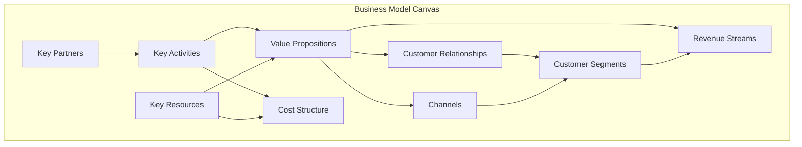
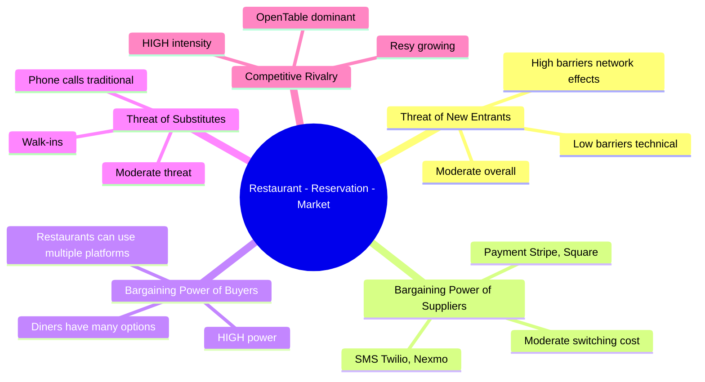
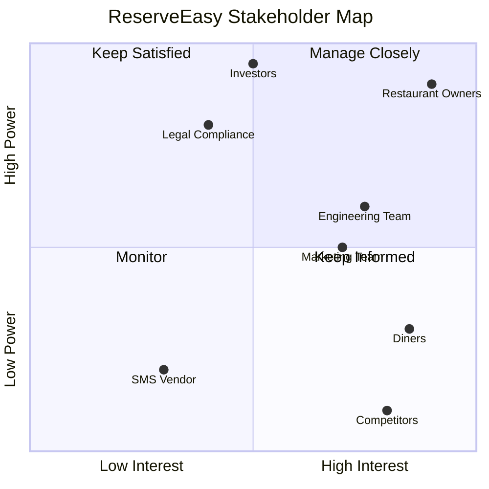
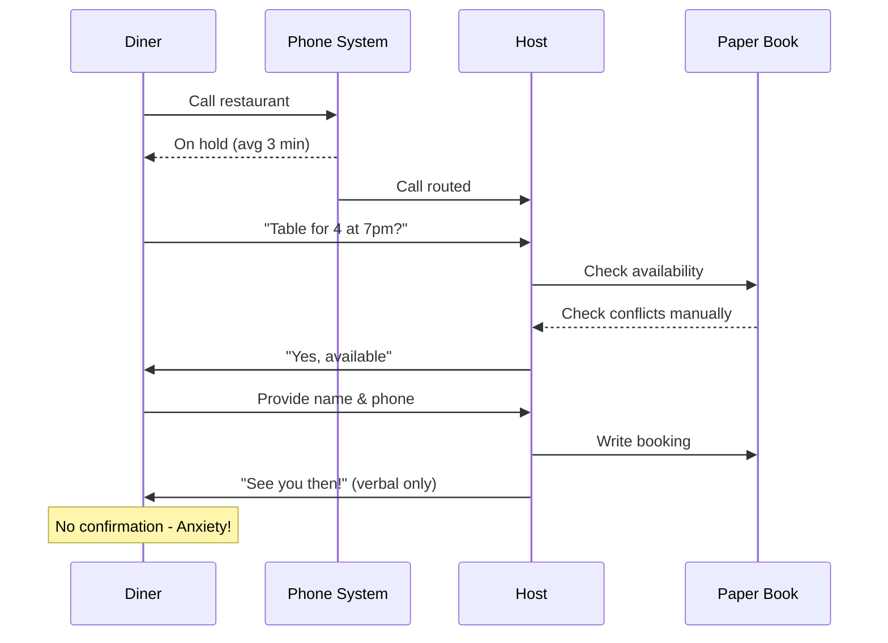
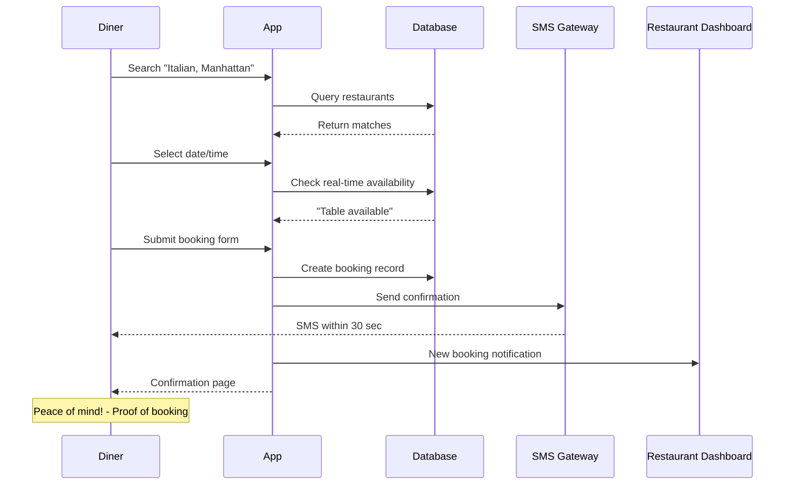

# Module 3: Strategy & Analysis

**Duration:** 2 weeks | **Difficulty:** ⭐⭐⭐⭐☆ | **Prerequisites:** Module 1

## Overview

Strategic thinking separates order-takers from leaders. This module teaches frameworks for **analyzing markets**, **understanding competition**, and **mapping business processes** to make informed decisions.

**You'll learn:**

- Business Model Canvas analysis
- Competitive analysis frameworks (SWOT, Porter's 5 Forces)
- Stakeholder mapping (Power-Interest Grid, RACI)
- Process mapping with BPMN diagrams

**ReserveEasy Application:** [Market Analysis](../02-reserve-easy-project/01-discovery/market-analysis.md)

---

## Table of Contents

1. [Business Model Canvas](#business-model-canvas)
2. [Competitive Analysis](#competitive-analysis)
3. [Stakeholder Management](#stakeholder-management)
4. [Process Mapping (BPMN)](#process-mapping-bpmn)
5. [SWOT Analysis](#swot-analysis)
6. [Porter's Five Forces](#porters-five-forces)
7. [Exercises](#exercises)

---

## Business Model Canvas

**Purpose:** Visualize all components of a business model on one page.

### The 9 Building Blocks

### ReserveEasy Business Model Canvas

| Block                      | Description                                                                                   |
| -------------------------- | --------------------------------------------------------------------------------------------- |
| **Customer Segments**      | 1) Diners (urban professionals, 25-45)  -  2) Restaurants (casual dining, 20-100 seats)     |
| **Value Propositions**     | Diners: Book in 60 sec, guaranteed seating  -  Restaurants: Reduce no-shows from 30% to <5% |
| **Channels**               | Web app (mobile-responsive), restaurant partner outreach, social media ads                    |
| **Customer Relationships** | Self-service platform, automated SMS, dedicated restaurant success team                       |
| **Revenue Streams**        | 10% commission on completed bookings                                                          |
| **Key Resources**          | Engineering team, SMS gateway (Twilio), payment processor (Stripe), restaurant relationships  |
| **Key Activities**         | Product development, restaurant onboarding, marketing, customer support                       |
| **Key Partners**           | Restaurants, Twilio (SMS), Stripe (payments), hosting (AWS)                                   |
| **Cost Structure**         | Engineering salaries ($300k/yr), hosting ($20k/yr), SMS fees ($5k/yr), marketing ($100k/yr)   |

**See Full Canvas:** [ReserveEasy Market Analysis](../02-reserve-easy-project/01-discovery/market-analysis.md)

---

## Competitive Analysis

### Framework 1: Competitive Matrix

| Feature                    | OpenTable   | Resy               | Yelp Reservations     | **ReserveEasy**              |
| -------------------------- | ----------- | ------------------ | --------------------- | ---------------------------- |
| **Target Market**          | Fine dining | Trendy restaurants | All restaurants       | Casual dining                |
| **Commission**             | 15-20%      | 10-15%             | Free (premium upsell) | 10%                          |
| **Deposit System**         | No          | Limited            | No                    | ✅ Yes                       |
| **SMS Confirmation**       | ✅ Yes      | ✅ Yes             | ❌ No                 | ✅ Yes                       |
| **Real-Time Availability** | ✅ Yes      | ✅ Yes             | ✅ Yes                | ✅ Yes                       |
| **Analytics Dashboard**    | ✅ Advanced | Basic              | Basic                 | ✅ Yes (focused on no-shows) |
| **Market Share**           | 60%         | 15%                | 10%                   | 0% (new entrant)             |

**Insight:** OpenTable dominates but charges high commissions. We differentiate on **lower cost + deposit system**.

---

### Framework 2: Porter's Five Forces

Analyzes industry attractiveness and competitive intensity.

**Analysis:**

- **Threat of New Entrants:** Moderate - Easy to build tech, hard to get restaurant network
- **Supplier Power:** Low - Many SMS/payment providers available
- **Buyer Power:** HIGH - Restaurants can multi-home (use multiple platforms)
- **Substitutes:** Moderate - Phone bookings still common for older demographics
- **Rivalry:** HIGH - OpenTable has 60% share, will defend aggressively

**Strategy:** Focus on underserved segment (casual dining), differentiate on cost + no-show reduction.

---

## Stakeholder Management

### Power-Interest Grid

**Engagement Strategy:**

| Quadrant           | Stakeholders                   | Strategy                                     |
| ------------------ | ------------------------------ | -------------------------------------------- |
| **Manage Closely** | Restaurant owners, Investors   | Weekly check-ins, involve in major decisions |
| **Keep Satisfied** | Legal, Compliance              | Monthly updates, escalate only big issues    |
| **Keep Informed**  | Engineering, Marketing, Diners | Regular newsletters, transparent roadmap     |
| **Monitor**        | SMS vendor, Competitors        | Standard communication only                  |

---

### RACI Matrix

Clarifies **R**esponsible, **A**ccountable, **C**onsulted, **I**nformed for key decisions.

| Decision/Task              | PM      | Engineering Lead | Design  | QA    | Stakeholders |
| -------------------------- | ------- | ---------------- | ------- | ----- | ------------ |
| Prioritize backlog         | **A/R** | C                | C       | I     | I            |
| Design mockups             | C       | I                | **A/R** | I     | C            |
| Write code                 | C       | **A/R**          | I       | I     | I            |
| Define acceptance criteria | **A/R** | C                | C       | **R** | I            |
| Approve for launch         | **A**   | R                | R       | R     | C            |

**Key:**

- **R** = Responsible (does the work)
- **A** = Accountable (final decision-maker, only ONE person)
- **C** = Consulted (provides input)
- **I** = Informed (kept in the loop)

---

## Process Mapping (BPMN)

**BPMN** = Business Process Model and Notation (industry standard for process diagrams).

### As-Is Process: Phone Booking (Current State)

**Pain Points:**

- 3-5 minute wait time
- No confirmation (diner worries if it was recorded)
- Host interrupted during dinner rush
- Paper book = no analytics

---

### To-Be Process: ReserveEasy Platform

**Improvements:**

- 60 seconds total (vs 5 minutes)
- Instant SMS confirmation
- Real-time availability (no double-bookings)
- Analytics automatically captured

**See Full Process Maps:** [ReserveEasy Process Maps](../02-reserve-easy-project/03-design/process-maps.md)

---

## SWOT Analysis

**Purpose:** Identify internal **S**trengths/**W**eaknesses and external **O**pportunities/**T**hreats.

### ReserveEasy SWOT

| **Strengths** (Internal, Positive)              | **Weaknesses** (Internal, Negative)     |
| ----------------------------------------------- | --------------------------------------- |
| ✅ Lower commission than OpenTable (10% vs 20%) | ❌ Zero market share (new entrant)      |
| ✅ Deposit system reduces no-shows              | ❌ Limited restaurant network initially |
| ✅ Focused on underserved casual dining         | ❌ No brand recognition                 |
| ✅ Modern tech stack (faster development)       | ❌ Smaller team than competitors        |

| **Opportunities** (External, Positive)       | **Threats** (External, Negative)                 |
| -------------------------------------------- | ------------------------------------------------ |
| 🚀 $17B lost to no-shows annually (huge TAM) | ⚠️ OpenTable could lower prices to defend market |
| 🚀 COVID accelerated online adoption         | ⚠️ Economic downturn = fewer diners              |
| 🚀 Gen Z prefers apps over phone calls       | ⚠️ Restaurants might build in-house systems      |
| 🚀 Delivery apps (Uber Eats) could partner   | ⚠️ Regulatory changes (data privacy)             |

**Strategic Implications:**

- **Leverage Strengths + Opportunities:** Market our low commission + no-show solution to restaurants struggling post-COVID
- **Mitigate Weaknesses:** Offer first 100 bookings free to build network quickly
- **Defend Against Threats:** Lock restaurants into annual contracts with volume discounts

---

## Exercises

### Exercise 1: Create a Business Model Canvas

Pick a product you use (Spotify, Uber, etc.) and fill out all 9 blocks.

---

### Exercise 2: Competitive Analysis

For ReserveEasy, research 2 competitors we didn't cover (e.g., Tock, Eat App). Add them to the competitive matrix.

---

### Exercise 3: Draw a To-Be Process Map

For the "Cancel Booking" feature, create a sequence diagram showing:

1. User clicks "Cancel"
2. System checks cancellation policy (24 hours?)
3. Processes refund if applicable
4. Sends SMS confirmation

---

## Key Takeaways

✅ Business Model Canvas visualizes your entire business on one page

✅ Competitive analysis identifies differentiation opportunities

✅ Stakeholder mapping ensures you engage the right people at the right intensity

✅ BPMN process maps clarify As-Is vs To-Be states

✅ SWOT + Porter's Five Forces inform strategic decisions

---

## Next Steps

📖 **Read Next:** [Module 4: Data & Analytics](04-data-analytics.md)

🏗️ **Apply:** Review [ReserveEasy Market Analysis](../02-reserve-easy-project/01-discovery/market-analysis.md)

---

[← Previous: Agile Execution](02-agile-execution.md) | [Next: Data & Analytics →](04-data-analytics.md)
