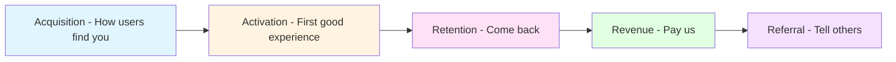
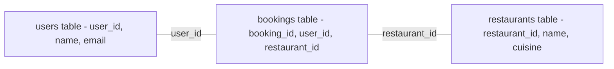

# Module 4: Data & Analytics

**Duration:** 2 weeks | **Difficulty:** ⭐⭐⭐⭐⭐ | **Prerequisites:** Module 1, 2

## Overview

Data fluency is what separates good PMs/BAs from great ones. This module teaches you to **think in metrics**, **write SQL queries**, and **run experiments** that drive business decisions.

**You'll learn:**

- Defining North Star Metrics and OKRs
- AARRR funnel framework (Pirate Metrics)
- SQL for business analysis (PostgreSQL)
- A/B testing and statistical significance

**ReserveEasy Application:** [Analytics Dashboard & SQL Queries](../02-reserve-easy-project/05-analytics/)

---

## Table of Contents

1. [Why Data Matters](#why-data-matters)
2. [North Star Metrics](#north-star-metrics)
3. [AARRR Funnel Framework](#aarrr-funnel-framework)
4. [OKRs (Objectives & Key Results)](#okrs-objectives--key-results)
5. [SQL Fundamentals](#sql-fundamentals)
6. [Funnel Analysis](#funnel-analysis)
7. [Cohort & Retention Analysis](#cohort--retention-analysis)
8. [A/B Testing](#ab-testing)
9. [Exercises](#exercises)

---

## Why Data Matters

**The Shift:** Product decisions moved from **HiPPO** (Highest Paid Person's Opinion) to **data-driven**.

### Real-World Example

**Amazon's "Add to Cart" Button Color**

- **Before Data:** Designer chose orange because "it pops"
- **After A/B Test:** Yellow increased conversions by 11% → $290M additional revenue

**Lesson:** Intuition is a starting point. Data validates or refutes it.

---

## North Star Metric

**Definition:** The single metric that best captures the core value your product delivers to customers.

### Characteristics of a Good North Star

- **Measures customer value** (not just business revenue)
- **Predictive of long-term success**
- **Actionable** (teams can influence it)
- **Simple to understand**

### ReserveEasy North Star: Monthly Active Bookers (MAB)

**Why "Monthly Active Bookers" not "Total Bookings"?**

| Metric                     | Why NOT North Star                                                         | Risk                     |
| -------------------------- | -------------------------------------------------------------------------- | ------------------------ |
| Total Bookings             | Can game by adding fake restaurants                                        | Vanity metric            |
| Total Registered Users     | Users who signed up but never book = not valuable                          | Misleading growth        |
| Revenue                    | Short-term focus; might hurt UX to maximize revenue                        | Optimize for wrong thing |
| **Monthly Active Bookers** | ✅ Captures users getting value ✅ Correlated with revenue ✅ Hard to game | None                     |

**How It Works:**

```
If MAB is growing:
├── More diners booking → More value delivered
├── More restaurants joining → Platform effect
└── More repeat usage → Product-market fit

If MAB is flat/declining:
├── Investigate: Acquisition problem? Retention problem?
└── Fix the funnel
```

**See Full Definition:** [ReserveEasy North Star Metric](../02-reserve-easy-project/05-analytics/north-star-metric.md)

---

## AARRR Funnel Framework

Also called **Pirate Metrics** (AARRR = "Arrr!"). Tracks users through 5 stages:



### ReserveEasy AARRR Breakdown

#### 1. Acquisition

**Definition:** How do users discover ReserveEasy?

**Channels:**

- Google Search ("restaurant reservation app")
- Social Media (Instagram ads)
- Direct (URL typed in)
- Referral (friend shared link)

**Key Metrics:**

- Cost Per Acquisition (CPA) = Marketing Spend / New Users
- Channel Mix (% from each source)

**SQL Query:**

```sql
SELECT
    acquisition_channel,
    COUNT(DISTINCT user_id) AS new_users,
    DATE_TRUNC('week', signup_date) AS week
FROM users
WHERE signup_date >= NOW() - INTERVAL '3 months'
GROUP BY week, acquisition_channel
ORDER BY week DESC, new_users DESC;
```

---

#### 2. Activation

**Definition:** First meaningful experience (the "aha moment").

**For ReserveEasy:** User completes their first booking.

**Why This Matters:** Users who complete 1 booking have 65% retention. Users who don't? 5% retention.

**Activation Metric:** % of users who complete a booking within 7 days of signup.

**Target:** >40%

**SQL Query:**

```sql
SELECT
    DATE_TRUNC('week', u.signup_date) AS cohort_week,
    COUNT(DISTINCT u.user_id) AS signups,
    COUNT(DISTINCT b.user_id) AS activated_users,
    ROUND(100.0 * COUNT(DISTINCT b.user_id) / COUNT(DISTINCT u.user_id), 1) AS activation_rate_pct
FROM users u
LEFT JOIN bookings b ON u.user_id = b.user_id
    AND b.created_at <= u.signup_date + INTERVAL '7 days'
WHERE u.signup_date >= NOW() - INTERVAL '3 months'
GROUP BY cohort_week
ORDER BY cohort_week DESC;
```

---

#### 3. Retention

**Definition:** Users coming back after their first experience.

**Types:**

- **Day 7 Retention:** % who return within 7 days
- **Day 30 Retention:** % who return within 30 days
- **Month 2 Retention:** % active in 2nd month

**ReserveEasy Target:** 40% Day 30 retention (industry benchmark: 25%)

**See SQL:** [Cohort Retention Analysis](../02-reserve-easy-project/05-analytics/queries/retention_cohort.sql)

---

#### 4. Revenue

**Definition:** How do we monetize?

**ReserveEasy Model:** 10% commission on completed bookings.

**Key Metrics:**

- Average Revenue Per User (ARPU)
- Customer Lifetime Value (LTV)
- Payback Period (How long to recover CAC?)

**Formula:**

```
LTV = ARPU × (1 / Churn Rate)

Example:
- ARPU = $5/month
- Monthly Churn = 10% (0.10)
- LTV = $5 / 0.10 = $50

If CAC = $30, Payback = 6 months ($30 / $5)
```

---

#### 5. Referral

**Definition:** Users telling others (viral growth).

**ReserveEasy Referral:** "Invite a friend, you both get $5 credit."

**Viral Coefficient (K):**

```
K = (Invites per User) × (Conversion Rate)

Example:
- Each user invites 3 friends
- 20% accept and sign up
- K = 3 × 0.20 = 0.6

If K > 1: Viral loop (exponential growth)
If K < 1: Need paid acquisition
```

---

## OKRs (Objectives & Key Results)

**Structure:** Qualitative goal (Objective) + Quantitative measures (Key Results).

### ReserveEasy Q1 2026 OKRs

**Objective:** Become the go-to platform for casual dining reservations in NYC.

**Key Results:**

1. **KR1:** Increase Monthly Active Bookers from 5,000 to 15,000 (+200%)
2. **KR2:** Achieve 40% Day 30 retention (up from 25%)
3. **KR3:** Onboard 500 new restaurants (currently 150)
4. **KR4:** Reduce average booking time from 3 minutes to 60 seconds

**How to Measure:**

- KR1: SQL query counting distinct users with bookings
- KR2: Cohort retention analysis
- KR3: COUNT(\*) from restaurants table
- KR4: Analytics event tracking (time between page load and confirmation)

**See Template:** [OKR Framework](../03-toolkit/checklists/definition-of-done.md)

---

## SQL Fundamentals

**Why SQL?** It's the universal language for querying databases. Every tech company uses it.

### Essential SQL for PM/BA

#### SELECT (Read Data)

```sql
-- Get all bookings from the last 7 days
SELECT
    booking_id,
    user_id,
    restaurant_id,
    booking_date,
    party_size,
    created_at
FROM bookings
WHERE created_at >= NOW() - INTERVAL '7 days'
ORDER BY created_at DESC;
```

---

#### Aggregations (COUNT, SUM, AVG)

```sql
-- How many bookings per restaurant this month?
SELECT
    r.restaurant_name,
    COUNT(*) AS total_bookings,
    SUM(party_size) AS total_guests,
    ROUND(AVG(party_size), 1) AS avg_party_size
FROM bookings b
JOIN restaurants r ON b.restaurant_id = r.restaurant_id
WHERE b.created_at >= DATE_TRUNC('month', NOW())
GROUP BY r.restaurant_name
ORDER BY total_bookings DESC
LIMIT 10;
```

---

#### Filters (WHERE, HAVING)

```sql
-- Find restaurants with >20 bookings this month
SELECT
    r.restaurant_name,
    COUNT(*) AS bookings
FROM bookings b
JOIN restaurants r ON b.restaurant_id = r.restaurant_id
WHERE b.created_at >= DATE_TRUNC('month', NOW())
GROUP BY r.restaurant_name
HAVING COUNT(*) > 20
ORDER BY bookings DESC;
```

---

#### Joins (Combine Tables)



```sql
-- Get user name, restaurant name, and booking details
SELECT
    u.name AS user_name,
    r.restaurant_name,
    b.booking_date,
    b.party_size
FROM bookings b
JOIN users u ON b.user_id = u.user_id
JOIN restaurants r ON b.restaurant_id = r.restaurant_id
WHERE b.booking_date = '2026-02-15';
```

---

## Funnel Analysis

**Purpose:** Identify where users drop off in a multi-step process.

### ReserveEasy Booking Funnel

```
Step 1: Search → 10,000 users
Step 2: View Restaurant → 7,000 users (30% drop-off)
Step 3: Select Date/Time → 5,000 users (29% drop-off)
Step 4: Enter Details → 4,000 users (20% drop-off)
Step 5: Payment → 3,500 users (13% drop-off)
Step 6: Confirmation → 3,500 users (0% drop-off)
```

**Analysis:**

- Biggest drop: Search → View (30%) - Why? Maybe search results are irrelevant
- Smallest drop: Payment → Confirmation (0%) - Good! No technical issues

**SQL Query:** [See Full Funnel Analysis](../02-reserve-easy-project/05-analytics/queries/funnel_analysis.sql)

---

## Cohort & Retention Analysis

**Cohort:** A group of users who share a common characteristic (e.g., signed up the same week).

**Why Cohorts?** Compare apples to apples. Jan 2026 users vs Feb 2026 users.

### Retention Table Example

| Signup Week | Week 0 | Week 1 | Week 2 | Week 3 | Week 4 |
| ----------- | ------ | ------ | ------ | ------ | ------ |
| Jan 1-7     | 100%   | 45%    | 38%    | 35%    | 30%    |
| Jan 8-14    | 100%   | 50%    | 42%    | 40%    | 38%    |
| Jan 15-21   | 100%   | 55%    | 48%    | 45%    | 43%    |

**Insight:** Each cohort is retaining better than the last → Product improvements are working!

**SQL Query:** [See Cohort Analysis](../02-reserve-easy-project/05-analytics/queries/retention_cohort.sql)

---

## A/B Testing

**Definition:** Show 50% of users Version A, 50% Version B. Measure which performs better.

### ReserveEasy A/B Test: Button Text

**Hypothesis:** Changing the booking button from "Book Now" to "Reserve Table" will increase click-through rate.

**Setup:**

- **Control (A):** "Book Now" (current)
- **Variant (B):** "Reserve Table" (new)
- **Metric:** Click-through rate (CTR)
- **Sample Size:** 5,000 users per group
- **Duration:** 1 week

**Results:**

| Group             | Users | Clicked | CTR   |
| ----------------- | ----- | ------- | ----- |
| A (Book Now)      | 5,000 | 1,250   | 25.0% |
| B (Reserve Table) | 5,000 | 1,400   | 28.0% |

**Difference:** +3 percentage points (~12% relative increase)

**Is it statistically significant?** Use a chi-square test or Z-test.

**SQL Query:** [See A/B Test Analysis](../02-reserve-easy-project/05-analytics/queries/ab_test_results.sql)

**Decision:** Ship "Reserve Table" to 100% of users.

---

## Exercises

### Exercise 1: Define Your North Star

Pick a product (Spotify, Uber, Netflix). What's their North Star Metric?

**Example:** Spotify → "Monthly Active Listener-Hours"

---

### Exercise 2: Calculate AARRR Metrics

For ReserveEasy, calculate:

- Acquisition Cost (if we spent $5,000 on ads and got 1,000 signups)
- Activation Rate (if 400 of those 1,000 completed a booking)
- Month 2 Retention (if 250 were still active in Month 2)

---

### Exercise 3: Write SQL Queries

1. Get top 5 restaurants by total bookings
2. Calculate average party size by cuisine type
3. Find users who booked last month but not this month (churned users)

---

## Key Takeaways

✅ North Star Metric aligns the entire company on what matters

✅ AARRR framework helps diagnose where to focus (acquisition vs retention vs revenue)

✅ SQL is a **must-have skill** for data-driven PMs/BAs

✅ Funnel analysis identifies conversion blockers

✅ Cohort analysis reveals if product improvements are working

✅ A/B testing removes guesswork from decisions

---

## Next Steps

📖 **Read Next:** [Module 5: Product Processes](05-product-process.md)

🏗️ **Apply:** Study the [ReserveEasy Analytics Setup](../02-reserve-easy-project/05-analytics/)

🔥 **Practice:** Write SQL queries using the [schema.sql](../02-reserve-easy-project/05-analytics/schema.sql)

---

[← Previous: Strategy & Analysis](03-strategy-analysis.md) | [Next: Product Processes →](05-product-process.md)
