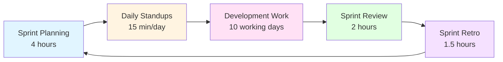
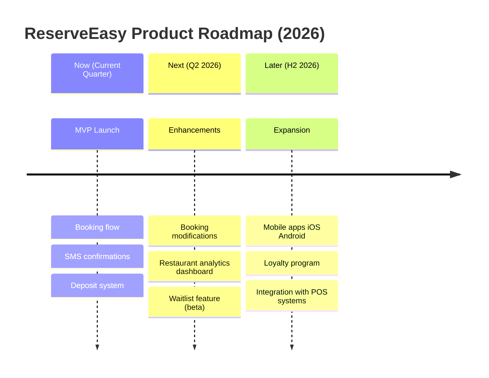

# Module 5: Product Processes

**Duration:** 1 week | **Difficulty:** ⭐⭐☆☆☆ | **Prerequisites:** Module 2

## Overview

Learn the **ceremonies, artifacts, and rhythms** of modern product teams. This module covers Scrum mechanics, roadmapping, and the day-to-day processes that keep teams aligned.

**You'll learn:**

- Scrum ceremonies (Sprint Planning, Standups, Review, Retro)
- Product roadmapping (Now/Next/Later)
- Release planning and versioning
- OKR quarterly planning

**ReserveEasy Application:** [Sprint 15 Plan](../02-reserve-easy-project/04-delivery/sprints/sprint-15-goal.md)

---

## Table of Contents

1. [The Scrum Framework](#the-scrum-framework)
2. [Sprint Planning](#sprint-planning)
3. [Daily Standup](#daily-standup)
4. [Sprint Review](#sprint-review)
5. [Sprint Retrospective](#sprint-retrospective)
6. [Product Roadmapping](#product-roadmapping)
7. [OKR Planning](#okr-planning)
8. [Key Takeaways](#key-takeaways)

---

## The Scrum Framework

**Scrum:** Agile framework for delivering complex products through iterative sprints.

### The Three Roles

| Role                 | Responsibility           | Key Activities                                      |
| -------------------- | ------------------------ | --------------------------------------------------- |
| **Product Owner**    | Maximize product value   | Prioritize backlog, write user stories, accept work |
| **Scrum Master**     | Facilitate Scrum process | Remove blockers, run ceremonies, coach team         |
| **Development Team** | Build the product        | Estimate, develop, test, deploy                     |

### The Sprint Cycle (2 weeks typical)

---

## Sprint Planning

**Duration:** 2-4 hours (for 2-week sprint)  
**Attendees:** Product Owner, Scrum Master, Dev Team  
**Goal:** Commit to work for the upcoming sprint

### Part 1: What Are We Building? (1-2 hours)

1. **PO presents Sprint Goal:** "Enable users to modify reservations"
2. **Team reviews top backlog items** (already refined)
3. **Team asks clarifying questions**
4. **Team commits:** "We'll complete US-045, US-046, US-047" (21 points based on velocity)

**Inputs:**

- Prioritized product backlog
- Team velocity (last 3 sprints: 18, 21, 24 → avg 21)
- Definition of Ready checklist

**Outputs:**

- Sprint Goal (1 sentence)
- Sprint Backlog (committed user stories)

---

### Part 2: How Will We Build It? (1-2 hours)

1. **Team breaks stories into technical tasks**
2. **Identifies dependencies**
3. **Each developer picks initial tasks**

**Example Breakdown:**

**US-045:** As a diner, I want to change my reservation time

**Technical Tasks:**

- [ ] Add "Modify" button to booking confirmation page (Frontend - 0.5 days)
- [ ] Create `PATCH /api/v1/bookings/{id}` endpoint (Backend - 1 day)
- [ ] Check real-time availability before allowing change (Backend - 1 day)
- [ ] Send updated SMS confirmation (Backend - 0.5 days)
- [ ] Write unit tests (Backend - 0.5 days)
- [ ] UAT test cases (QA - 0.5 days)

**Total:** ~4 days of work

---

## Daily Standup

**Duration:** 15 minutes MAX  
**Time:** Same time every day (e.g., 9:30 AM)  
**Attendees:** Dev Team (PO/SM optional)

### The Three Questions

Each person answers:

1. **What did I complete yesterday?**
2. **What will I work on today?**
3. **Are there any blockers?**

**Example:**

> **Alice (Frontend):**
>
> - Yesterday: Finished "Modify" button UI
> - Today: Integrate with PATCH API
> - Blockers: None
>
> **Bob (Backend):**
>
> - Yesterday: Built PATCH endpoint
> - Today: Add availability validation
> - Blockers: Waiting for Staging database refresh (DevOps)
>
> **Scrum Master:**  
> Action: I'll follow up with DevOps to unblock Bob.

### Anti-Patterns to Avoid

❌ **Reporting to the manager:** This is peer-to-peer sync, not a status report  
❌ **Problem-solving:** Take complex discussions offline  
❌ **Going over 15 min:** Use a timer, respect everyone's time

---

## Sprint Review (Demo)

**Duration:** 1-2 hours  
**Attendees:** Team + Stakeholders (execs, customers)  
**Goal:** Demo completed work, gather feedback

### Agenda

1. **Recap Sprint Goal** (5 min)
   - PO: "Our goal was to enable booking modifications. Here's what we shipped."

2. **Live Demo** (30-45 min)
   - Team shows working software (not slides!)
   - **Example:** "Sarah logs in, clicks 'My Reservations,' selects one, clicks 'Modify Time,' system checks availability in real-time, she picks a new time, boom - SMS sent with new details."

3. **Stakeholder Feedback** (15-30 min)
   - Stakeholder: "Love it! Can we also let her change party size?"
   - PO: "Great idea - I'll add that to the backlog as US-048."

4. **What Didn't Get Done** (5 min)
   - PO: "We committed to US-047 (restaurant approval) but it got blocked by a database migration. Moving to Sprint 16."

### Definition of Demo-Ready

- [ ] Deployed to **staging environment** (not localhost!)
- [ ] No critical bugs
- [ ] Acceptance criteria met
- [ ] Product Owner approved

---

## Sprint Retrospective

**Duration:** 1-1.5 hours  
**Attendees:** Dev Team only (safe space)  
**Goal:** Improve processes, not judge people

### Format: Start / Stop / Continue

**Facilitator (Scrum Master):** "What should we START doing?"

- Developer: "START pair programming on complex features - reduces bugs"
- QA: "START writing test cases before development (shift-left testing)"

**"What should we STOP doing?"**

- Developer: "STOP having meetings without agendas - wasted 2 hours this sprint"
- Designer: "STOP making last-minute design changes mid-sprint"

**"What should we CONTINUE doing?"**

- Team: "CONTINUE Friday afternoon demos - great visibility"
- PO: "CONTINUE backlog refinement mid-sprint - stories are well-defined"

### Action Items (Max 2-3)

| Action Item                                    | Owner        | Due Date        |
| ---------------------------------------------- | ------------ | --------------- |
| Set up pair programming rotation               | Alice        | Sprint 16 Day 1 |
| Create "meeting agenda" template in Confluence | Scrum Master | End of week     |

**Retrospective Prime Directive:**

> "Regardless of what we discover, we understand and truly believe that everyone did the best job they could, given what they knew at the time, their skills and abilities, the resources available, and the situation at hand."

---

## Product Roadmapping

**Purpose:** Communicate the product vision and sequencing of major initiatives.

### Now / Next / Later Framework

**Why Not Dates?**

- Dates create false commitments ("You promised June!")
- Priorities change based on learnings
- "Now/Next/Later" gives direction without rigidity

### Communicating the Roadmap

**To Executives:** Focus on business outcomes

> "Q1: Launch MVP → Onboard 50 restaurants  
> Q2: Reduce churn → Build analytics dashboard"

**To Customers:** Focus on problem-solving

> "Coming soon: Easier changes to your reservations based on your feedback!"

**To Engineering:** Focus on technical milestones

> "Sprint 15-18: Booking modification epic  
> Sprint 19-22: Analytics infrastructure"

---

## OKR Planning

**OKR** = Objectives and Key Results (quarterly goal-setting framework from Intel/Google)

### ReserveEasy Q1 2026 OKRs

**Objective 1:** Launch MVP and prove product-market fit

**Key Results:**

- **KR1:** Onboard 50 restaurant partners (currently 0)
- **KR2:** Facilitate 5,000 bookings in March (currently 0)
- **KR3:** Achieve 40% Day 30 retention (industry: 25%)

---

**Objective 2:** Build a sustainable growth engine

**Key Results:**

- **KR1:** Customer Acquisition Cost (CAC) < $30
- **KR2:** Achieve 20% booking conversion rate (search → booking)
- **KR3:** Net Promoter Score (NPS) > 40

---

### OKR Best Practices

✅ **Ambitious but achievable:** Should have ~70% confidence of hitting it  
✅ **3-5 Key Results per Objective:** More = lack of focus  
✅ **Measurable:** "Increase revenue" → "Increase revenue to $100k"  
✅ **Time-bound:** Quarterly cadence  
❌ **Not a task list:** OKRs are outcomes, not activities

**Grading:** At quarter-end, score each KR:

- 0.0-0.3: Red (missed)
- 0.4-0.6: Yellow (partial)
- 0.7-1.0: Green (hit/exceeded)

**Target:** 70% average (if you hit 100% every time, goals aren't ambitious enough)

---

## Key Takeaways

✅ Sprint Planning commits the team to a realistic amount of work based on velocity

✅ Daily Standups are for coordination, not reporting

✅ Sprint Review demos working software to gather feedback

✅ Retrospectives improve process through Start/Stop/Continue

✅ Now/Next/Later roadmaps communicate direction without rigid dates

✅ OKRs align the team on ambitious, measurable quarterly goals

---

## Next Steps

📖 **Read Next:** [Module 6: Quality Assurance](06-quality-assurance.md)

🏗️ **Apply:** Review [Sprint 15 Plan](../02-reserve-easy-project/04-delivery/sprints/sprint-15-goal.md)

---

[← Previous: Data & Analytics](04-data-analytics.md) | [Next: Quality Assurance →](06-quality-assurance.md)
