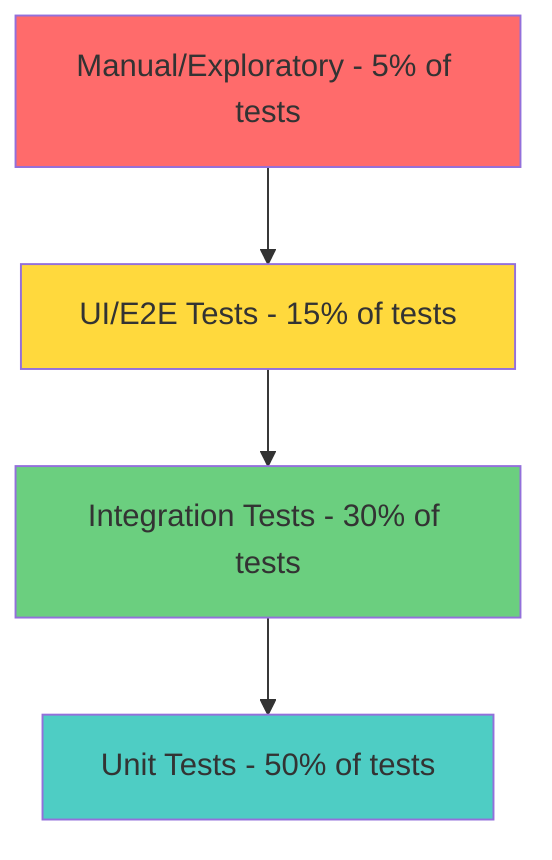

# Module 6: Quality Assurance

**Duration:** 1 week | **Difficulty:** ⭐⭐⭐☆☆ | **Prerequisites:** Module 2

## Overview

Quality isn't just QA's job - it's everyone's responsibility. This module teaches how to **plan testing**, **write test cases**, and **ensure product reliability** before launch.

**You'll learn:**

- Test planning strategies
- Writing detailed test cases
- Defect management and severity classification
- User Acceptance Testing (UAT)

**ReserveEasy Application:** [Master Test Plan](../02-reserve-easy-project/06-qa/master-test-plan.md)

---

## Table of Contents

1. [Types of Testing](#types-of-testing)
2. [Test Planning](#test-planning)
3. [Writing Test Cases](#writing-test-cases)
4. [Defect Management](#defect-management)
5. [User Acceptance Testing (UAT)](#user-acceptance-testing-uat)
6. [Key Takeaways](#key-takeaways)

---

## Types of Testing

### Testing Pyramid



**Principle:** More automated tests at the base (cheap, fast) → Fewer manual tests at the top (expensive, slow)

---

### Functional vs Non-Functional Testing

| Type               | What It Tests              | Example                                     |
| ------------------ | -------------------------- | ------------------------------------------- |
| **Functional**     | Features work as specified | "Can a user book a table?"                  |
| **Non-Functional** | Quality attributes         | "Does the booking page load in <2 seconds?" |

### ReserveEasy Test Types

| Test Type             | Scope                                              | Who Runs                       |
| --------------------- | -------------------------------------------------- | ------------------------------ |
| **Unit Tests**        | Individual functions (e.g., `validateEmail()`)     | Developers (automated)         |
| **Integration Tests** | APIs, database interactions                        | Developers (automated)         |
| **System Tests**      | End-to-end user flows                              | QA (mix of automated + manual) |
| **UAT**               | Real users validate it solves their problem        | Stakeholders (manual)          |
| **Performance Tests** | Load testing (can it handle 10k concurrent users?) | DevOps/QA (automated)          |
| **Security Tests**    | Penetration testing, SQL injection                 | Security team (specialized)    |

---

## Test Planning

**Master Test Plan** = Strategy document outlining testing approach for the project.

### Key Sections

1. **Scope:** What's in/out of testing?
   - In: Booking flow, payment, SMS
   - Out: Third-party systems (Stripe, Twilio) - we test integration, not their internals

2. **Test Strategy:** Which types of testing?
   - Unit: 80% code coverage required
   - Integration: API contract tests
   - Manual: Critical user journeys

3. **Entry/Exit Criteria:**
   - **Entry:** Code deployed to staging, no P0 bugs from previous sprint
   - **Exit:** All test cases pass, no P0/P1 bugs, UAT sign-off

4. **Test Environment:** Staging (mirrors production)

5. **Schedule:** 2 days of testing per 2-week sprint

6. **Risks:**
   - Risk: SMS delivery failures
   - Mitigation: Test with Twilio sandbox, monitor delivery rates

**See Full Plan:** [ReserveEasy Master Test Plan](../02-reserve-easy-project/06-qa/master-test-plan.md)

---

## Writing Test Cases

**Test Case:** Step-by-step instructions to verify a specific scenario.

### Test Case Template

```
Test Case ID: TC-001
Title: Guest user can complete a booking
Priority: P0 (Critical)
Prerequisites:
- Staging environment is live
- Test restaurant "Bella Italia" has availability on tomorrow's date

Steps:
1. Navigate to https://staging.reserveeasy.com
2. Enter "Italian" in cuisine search field
3. Click "Search"
4. Click on "Bella Italia" restaurant card
5. Select tomorrow's date from calendar
6. Select party size: 4
7. Click "Check Availability"
8. Select time slot: 7:00 PM
9. Click "Book This Time"
10. Fill booking form:
    - Name: Test User
    - Email: test@example.com
    - Phone: +15551234567
11. Click "Confirm Booking"

Expected Result:
- Confirmation page displays with booking details
- Confirmation code is shown (format: 6 uppercase letters, e.g., "ABC123")
- SMS is received within 30 seconds to +15551234567
- SMS contains restaurant name, date, time, party size, confirmation code

Actual Result: [To be filled by tester]

Status: [ ] Pass  [ ] Fail  [ ] Blocked

Tested By: _______  Date: _______
```

**See Example:** [TC-001 Guest Booking](../02-reserve-easy-project/06-qa/test-cases/TC-001-guest-booking.md)

---

### Test Case Best Practices

✅ **One scenario per test case:** Don't combine "guest booking" and "logged-in booking" in one test  
✅ **Clear prerequisites:** List required setup  
✅ **Specific steps:** "Click 'Search'" not "Search for restaurant"  
✅ **Measurable expected results:** "SMS received within 30 seconds" not "SMS received quickly"  
✅ **Include edge cases:** Empty fields, invalid email, past dates

---

### Edge Cases to Test

| Scenario              | Test Case                                                              |
| --------------------- | ---------------------------------------------------------------------- |
| **Boundary Values**   | Party size = 1, Party size = 20 (max), Party size = 21 (should fail)   |
| **Invalid Input**     | Email = "notanemail", Phone = "123" (too short)                        |
| **Timing Edge Cases** | Book for today (should work if > 2 hours away)                         |
| **Concurrency**       | Two users book the last table simultaneously → Only one should succeed |
| **Failures**          | SMS gateway is down → Should fallback to email                         |

---

## Defect Management

**Defect (Bug):** Any behavior that deviates from requirements or expected behavior.

### Severity Classification

| Severity          | Definition                                  | Example                                                              | SLA to Fix                   |
| ----------------- | ------------------------------------------- | -------------------------------------------------------------------- | ---------------------------- |
| **P0 (Critical)** | System down, data loss, security breach     | Booking API returns 500 errors → No one can book                     | Hotfix within 2 hours        |
| **P1 (High)**     | Major feature broken, many users affected   | SMS confirmations not sending → Users anxious                        | Fix in current sprint        |
| **P2 (Medium)**   | Feature partially broken, workaround exists | "Modify Reservation" button doesn't work, but users can call support | Fix in next 1-2 sprints      |
| **P3 (Low)**      | Cosmetic issue, minimal impact              | Button color is wrong, typo in error message                         | Backlog, fix when convenient |

---

### Defect Report Template

```
Bug ID: BUG-234
Title: SMS confirmation fails for international numbers
Severity: P1 (High)
Environment: Production
Steps to Reproduce:
1. Complete a booking as a guest
2. Enter phone number: +44 7911 123456 (UK number)
3. Submit booking

Expected: SMS delivered within 30 seconds
Actual: SMS never arrives, no error shown to user

Impact: 15% of our users are international → They don't get confirmation

Root Cause (if known): Twilio account only configured for US/Canada numbers

Suggested Fix: Enable international SMS in Twilio settings

Assigned To: Backend team
Priority: Must fix before EU launch
```

**See Example:** [BUG-234 SMS Failure](../02-reserve-easy-project/06-qa/bug-reports/BUG-234-sms-fail.md)

---

### Bug Triage Process

1. **QA files bug** with steps to reproduce
2. **PM reviews:** Confirms severity, assigns priority
3. **Engineering investigates:** Reproduces, determines root cause
4. **Fix implemented:** Code review, testing
5. **QA verifies fix:** Re-tests on staging
6. **Bug closed:** Deploy to production, mark as "Resolved"

---

## User Acceptance Testing (UAT)

**Definition:** Final validation by actual users/stakeholders before go-live.

### When to Run UAT

- Before major releases (MVP launch, big features)
- After a series of sprints (quarterly check-in)

### Who Participates

- **Internal:** Product Manager, key stakeholders
- **External:** Friendly customers (beta testers)

### UAT Process

1. **Preparation:**
   - Deploy to UAT environment (identical to production)
   - Prepare test scenarios (real-world workflows)
   - Invite testers, schedule sessions

2. **Execution:**
   - Testers follow scenarios
   - QA observes, takes notes
   - Bugs logged in real-time

3. **Sign-Off:**
   - Stakeholders formally approve: "This is ready for production"
   - PM documents approval in UAT Sign-Off doc

**UAT Sign-Off Criteria:**

- [ ] All P0 test scenarios pass
- [ ] No P0 or P1 bugs outstanding
- [ ] Performance benchmarks met (page load <2s)
- [ ] Stakeholder approval obtained

---

## Key Takeaways

✅ Testing pyramid: Many unit tests, fewer manual tests

✅ Master Test Plan defines strategy, scope, and success criteria

✅ Test cases are detailed, step-by-step scripts with expected results

✅ Defects are classified by severity (P0-P3) to prioritize fixes

✅ UAT is the final gate before production launch

---

## Next Steps

📖 **Read Next:** [Module 7: Technical Fluency](07-technical-fluency.md)

🏗️ **Apply:** Study [ReserveEasy Test Cases](../02-reserve-easy-project/06-qa/test-cases/)

---

[← Previous: Product Processes](05-product-process.md) | [Next: Technical Fluency →](07-technical-fluency.md)
