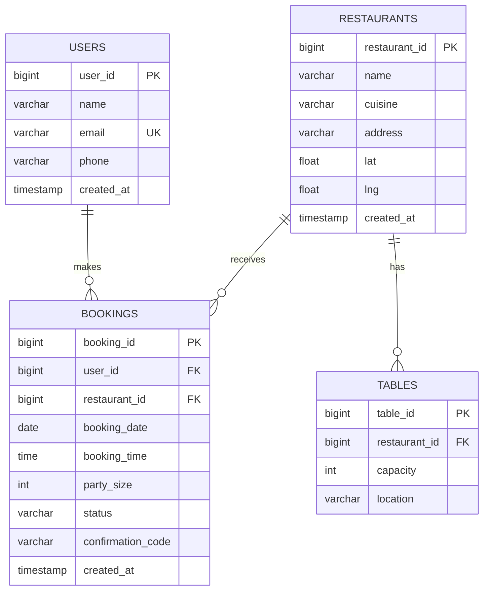
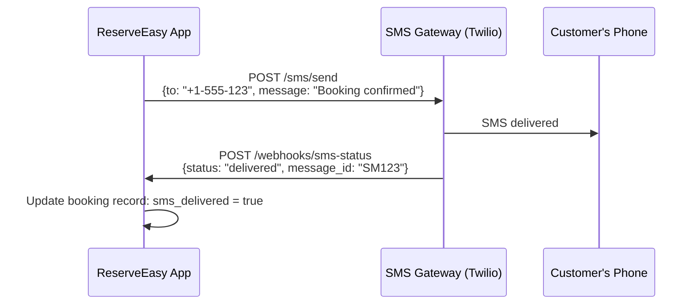

# Module 7: Technical Fluency

**Duration:** 2 weeks | **Difficulty:** ⭐⭐⭐⭐⭐ | **Prerequisites:** Module 1, 4

## Overview

**This is your competitive advantage.** Most PMs/BAs can write user stories. Few can design APIs, understand database schemas, or speak the language of engineers. This module teaches you to be **technical without being an engineer**.

**You'll learn:**

- REST API design using OpenAPI/Swagger
- Database schema design (ERDs, normalization)
- Webhooks and event-driven architecture
- Cloud architecture basics (SaaS, microservices)

**Reserve Easy Application:** [API Specs & Database Schema](../02-reserve-easy-project/02-specs/API-specs/)

---

## Table of Contents

1. [Why Technical Fluency Matters](#why-technical-fluency-matters)
2. [REST API Fundamentals](#rest-api-fundamentals)
3. [OpenAPI/Swagger Specification](#openapiswagger-specification)
4. [Database Schema Design](#database-schema-design)
5. [Webhooks & Events](#webhooks--events)
6. [Cloud Architecture Basics](#cloud-architecture-basics)
7. [Exercises](#exercises)

---

## Why Technical Fluency Matters

### In Interviews

**Without Technical Fluency:**

> "I wrote user stories and worked with the engineering team to build the feature."

**With Technical Fluency:**

> "I designed the booking API spec in OpenAPI format so frontend and backend could work in parallel. We went with a POST /api/v1/bookings endpoint that accepts JSON with restaurant_id, date, time, and party_size. The response includes a booking_id and confirmation_code stored in the bookings table. We handled conflicts with optimistic locking in PostgreSQL."

**Who gets the offer?**

---

### In Daily Work

| Scenario                                   | Non-Technical PM/BA    | Technical PM/BA                                                                                           |
| ------------------------------------------ | ---------------------- | --------------------------------------------------------------------------------------------------------- |
| **Engineer says "This will take 3 weeks"** | Accepts blindly        | "What's the complexity? Is it the OAuth integration or the UI? Can we de-scope?"                          |
| **Discussing architecture**                | Silent in meetings     | "Since we're already using Redis for caching, can we store availability there instead of hitting the DB?" |
| **Writing requirements**                   | "System shall be fast" | "API response time shall be <500ms at p95 for 10,000 RPS"                                                 |

**Result:** Technical PMs/BAs earn 20-30% more and advance faster.

---

## REST API Fundamentals

**API (Application Programming Interface):** A contract between two software systems on how to communicate.

**REST (Representational State Transfer):** An architectural style for designing networked applications.

### HTTP Methods (Verbs)

| Method     | Purpose                 | Example              | Idempotent?      |
| ---------- | ----------------------- | -------------------- | ---------------- |
| **GET**    | Read data               | GET /restaurants/123 | Yes (repeatable) |
| **POST**   | Create new resource     | POST /bookings       | No               |
| **PUT**    | Update entire resource  | PUT /bookings/456    | Yes              |
| **PATCH**  | Update part of resource | PATCH /bookings/456  | No               |
| **DELETE** | Remove resource         | DELETE /bookings/456 | Yes              |

**Idempotent:** Calling it multiple times has the same effect as calling it once.

---

### ReserveEasy Booking API Design

#### Create a Booking (POST)

**Endpoint:** `POST /api/v1/bookings`

**Request Body:**

```json
{
  "restaurant_id": 123,
  "booking_date": "2026-02-15",
  "booking_time": "19:00",
  "party_size": 4,
  "customer": {
    "name": "Sarah Chen",
    "email": "sarah@example.com",
    "phone": "+1-555-123-4567"
  },
  "special_requests": "Window seat if available"
}
```

**Response (201 Created):**

```json
{
  "booking_id": "bk_7x3mN9pQs2",
  "confirmation_code": "ABC123",
  "status": "confirmed",
  "restaurant": {
    "id": 123,
    "name": "Bella Italia",
    "address": "123 Main St, New York, NY"
  },
  "booking_date": "2026-02-15",
  "booking_time": "19:00",
  "party_size": 4,
  "created_at": "2026-02-08T18:30:00Z",
  "links": {
    "modify": "/api/v1/bookings/bk_7x3mN9pQs2",
    "cancel": "/api/v1/bookings/bk_7x3mN9pQs2/cancel"
  }
}
```

**Error Response (400 Bad Request):**

```json
{
  "error": {
    "code": "INVALID_DATE",
    "message": "Booking date must be in the future",
    "field": "booking_date"
  }
}
```

---

#### Retrieve a Booking (GET)

**Endpoint:** `GET /api/v1/bookings/{booking_id}`

**Response (200 OK):**

```json
{
  "booking_id": "bk_7x3mN9pQs2",
  "status": "confirmed",
  "restaurant": {...},
  "booking_date": "2026-02-15",
  "booking_time": "19:00",
  "party_size": 4
}
```

**Error (404 Not Found):**

```json
{
  "error": {
    "code": "BOOKING_NOT_FOUND",
    "message": "No booking found with ID bk_invalid"
  }
}
```

---

### Best Practices

#### 1. Use Nouns for Resources (Not Verbs)

❌ **Bad:** `/getBooking`, `/createBooking`  
✅ **Good:** `GET /bookings/{id}`, `POST /bookings`

#### 2. Use HTTP Status Codes Correctly

| Code | Meaning               | Use Case                                                               |
| ---- | --------------------- | ---------------------------------------------------------------------- |
| 200  | OK                    | Successful GET, PUT, PATCH                                             |
| 201  | Created               | Successful POST                                                        |
| 204  | No Content            | Successful DELETE                                                      |
| 400  | Bad Request           | Invalid input (e.g., missing required field)                           |
| 401  | Unauthorized          | Missing/invalid authentication                                         |
| 403  | Forbidden             | Authenticated but not allowed (e.g., accessing another user's booking) |
| 404  | Not Found             | Resource doesn't exist                                                 |
| 409  | Conflict              | Resource conflict (e.g., table already booked)                         |
| 500  | Internal Server Error | Server crashed                                                         |

#### 3. Version Your API

❌ **Bad:** `/bookings` (what happens when you make breaking changes?)  
✅ **Good:** `/api/v1/bookings` (can introduce /v2 without breaking existing clients)

#### 4. Use Pagination for Lists

```
GET /api/v1/bookings?page=2&limit=20
```

**Response:**

```json
{
  "data": [...],
  "pagination": {
    "page": 2,
    "limit": 20,
    "total": 487,
    "pages": 25
  }
}
```

---

## OpenAPI/Swagger Specification

**OpenAPI:** An industry standard for describing REST APIs in a machine-readable format (YAML or JSON).

**Benefits:**

- Auto-generate documentation (Swagger UI)
- Generate client SDKs (JavaScript, Python, etc.)
- Validate requests/responses
- Enable parallel development (frontend doesn't wait for backend)

---

### ReserveEasy Booking API (OpenAPI 3.0)

**File:** [booking-api.yaml](../02-reserve-easy-project/02-specs/API-specs/booking-api.yaml)

```yaml
openapi: 3.0.0
info:
  title: ReserveEasy Booking API
  version: 1.0.0
  description: API for creating and managing restaurant reservations

servers:
  - url: https://api.reserveeasy.com/v1
    description: Production
  - url: https://api-staging.reserveeasy.com/v1
    description: Staging

paths:
  /bookings:
    post:
      summary: Create a new booking
      operationId: createBooking
      tags:
        - Bookings
      requestBody:
        required: true
        content:
          application/json:
            schema:
              type: object
              required:
                - restaurant_id
                - booking_date
                - booking_time
                - party_size
                - customer
              properties:
                restaurant_id:
                  type: integer
                  example: 123
                booking_date:
                  type: string
                  format: date
                  example: "2026-02-15"
                booking_time:
                  type: string
                  pattern: "^([01]?[0-9]|2[0-3]):[0-5][0-9]$"
                  example: "19:00"
                party_size:
                  type: integer
                  minimum: 1
                  maximum: 20
                  example: 4
                customer:
                  type: object
                  required:
                    - name
                    - email
                    - phone
                  properties:
                    name:
                      type: string
                      minLength: 2
                      maxLength: 100
                      example: "Sarah Chen"
                    email:
                      type: string
                      format: email
                      example: "sarah@example.com"
                    phone:
                      type: string
                      pattern: '^\+?[1-9]\d{1,14}$'
                      example: "+1-555-123-4567"
      responses:
        "201":
          description: Booking created successfully
          content:
            application/json:
              schema:
                $ref: "#/components/schemas/Booking"
        "400":
          description: Invalid input
          content:
            application/json:
              schema:
                $ref: "#/components/schemas/Error"
        "409":
          description: Table not available at requested time
          content:
            application/json:
              schema:
                $ref: "#/components/schemas/Error"

components:
  schemas:
    Booking:
      type: object
      properties:
        booking_id:
          type: string
          example: "bk_7x3mN9pQs2"
        confirmation_code:
          type: string
          example: "ABC123"
        status:
          type: string
          enum: [confirmed, pending, cancelled]
        # ... additional properties

    Error:
      type: object
      required:
        - code
        - message
      properties:
        code:
          type: string
          example: "INVALID_DATE"
        message:
          type: string
          example: "Booking date must be in the future"
        field:
          type: string
          example: "booking_date"
```

**See Full Spec:** [booking-api.yaml](../02-reserve-easy-project/02-specs/API-specs/booking-api.yaml)

---

### How to Use OpenAPI Specs

#### 1. Visualize with Swagger Editor

Go to [editor.swagger.io](https://editor.swagger.io), paste your YAML → instant interactive documentation!

#### 2. Generate Client Code

```bash
# Install OpenAPI Generator
npm install @openapitools/openapi-generator-cli -g

# Generate JavaScript client
openapi-generator-cli generate \
  -i booking-api.yaml \
  -g javascript \
  -o ./generated-client
```

Now frontend devs can call:

```javascript
const api = new BookingApi();
api.createBooking({restaurant_id: 123, ...});
```

#### 3. Mock Server

While backend builds the real API, frontend can test against a mock:

```bash
npx @stoplight/prism-cli mock booking-api.yaml
```

---

## Database Schema Design

**Relational Database:** Data stored in tables with relationships (e.g., PostgreSQL, MySQL).

### ReserveEasy Schema



---

### SQL Schema Definition

**File:** [schema.sql](../02-reserve-easy-project/05-analytics/schema.sql)

```sql
-- Users Table
CREATE TABLE users (
    user_id BIGSERIAL PRIMARY KEY,
    name VARCHAR(100) NOT NULL,
    email VARCHAR(255) UNIQUE NOT NULL,
    phone VARCHAR(20),
    created_at TIMESTAMP DEFAULT NOW()
);

-- Restaurants Table
CREATE TABLE restaurants (
    restaurant_id BIGSERIAL PRIMARY KEY,
    name VARCHAR(200) NOT NULL,
    cuisine VARCHAR(50),
    address TEXT,
    lat DECIMAL(10, 7),
    lng DECIMAL(10, 7),
    created_at TIMESTAMP DEFAULT NOW()
);

-- Bookings Table
CREATE TABLE bookings (
    booking_id BIGSERIAL PRIMARY KEY,
    user_id BIGINT REFERENCES users(user_id),
    restaurant_id BIGINT REFERENCES restaurants(restaurant_id),
    booking_date DATE NOT NULL,
    booking_time TIME NOT NULL,
    party_size INT NOT NULL CHECK (party_size >= 1 AND party_size <= 20),
    status VARCHAR(20) DEFAULT 'confirmed' CHECK (status IN ('confirmed', 'pending', 'cancelled', 'completed', 'no_show')),
    confirmation_code VARCHAR(10) UNIQUE NOT NULL,
    created_at TIMESTAMP DEFAULT NOW()
);

-- Indexes for Performance
CREATE INDEX idx_bookings_user ON bookings(user_id);
CREATE INDEX idx_bookings_restaurant ON bookings(restaurant_id);
CREATE INDEX idx_bookings_date ON bookings(booking_date);
```

---

### Database Design Principles

#### 1. Normalization (Avoid Redundancy)

❌ **Bad (Denormalized):**

```
bookings
├── booking_id
├── user_name (duplicated for every booking)
├── user_email (duplicated)
├── restaurant_name (duplicated)
└── restaurant_address (duplicated)
```

✅ **Good (Normalized):**

```
users (user_id, name, email)
restaurants (restaurant_id, name, address)
bookings (booking_id, user_id, restaurant_id)
```

**Benefit:** Update a restaurant's address once, not in 1,000 booking records.

#### 2. Use Foreign Keys

```sql
FOREIGN KEY (user_id) REFERENCES users(user_id)
```

**Benefit:** Database enforces referential integrity (can't create a booking for a non-existent user).

#### 3. Add Indexes for Queries

If you frequently query `WHERE booking_date = '2026-02-15'`:

```sql
CREATE INDEX idx_bookings_date ON bookings(booking_date);
```

**Benefit:** Query runs in milliseconds instead of seconds.

#### 4. Use Constraints

```sql
CHECK (party_size >= 1 AND party_size <= 20)
```

**Benefit:** Invalid data can't enter the database.

---

## Webhooks & Events

**Webhook:** A way for one system to notify another when something happens (event-driven).

### ReserveEasy SMS Webhook

**Scenario:** We use Twilio to send SMS. After Twilio delivers the message, it calls our webhook to confirm delivery.

**Flow:**



**Our Webhook Endpoint:**

```
POST /webhooks/sms-status
```

**Payload from Twilio:**

```json
{
  "MessageSid": "SM123abc",
  "MessageStatus": "delivered",
  "To": "+15551234567",
  "ErrorCode": null
}
```

**Our Logic:**

1. Receive webhook
2. Find booking by confirmation_code
3. Update `sms_delivered = true`
4. If status = "failed", retry or alert support

**See Documentation:** [Webhooks Guide](../02-reserve-easy-project/02-specs/API-specs/webhooks.md)

---

## Cloud Architecture Basics

### Monolith vs Microservices

**Monolith (ReserveEasy MVP):**

```
Single Application
├── User Management
├── Restaurant Search
├── Booking System
├── Payment Processing
└── SMS Notifications
```

**Pros:** Simple to develop and deploy  
**Cons:** Hard to scale parts independently

**Microservices (ReserveEasy v2):**

```
API Gateway
├── User Service (handles auth, profiles)
├── Search Service (restaurant discovery)
├── Booking Service (create/modify reservations)
├── Payment Service (handle deposits)
└── Notification Service (SMS, email)
```

**Pros:** Each service can scale independently  
**Cons:** More complex (need service discovery, API gateway)

---

### SaaS (Software as a Service)

Reserve Easy is a SaaS:

- **Multi-tenant:** One codebase serves many restaurants
- **Subscription Model:** Restaurants pay monthly
- **Cloud-Hosted:** AWS/GCP, not on-premise servers

**Key Considerations:**

- **Data Isolation:** Restaurant A can't see Restaurant B's bookings
- **Uptime SLAs:** 99.9% availability guarantee
- **Security:** SOC 2, GDPR compliance

---

## Exercises

### Exercise 1: Design an API Endpoint

Design the API for "Cancel a Booking":

- HTTP Method?
- Endpoint path?
- Request body?
- Success response (status code + body)?
- Error responses?

---

### Exercise 2: Create a Database Table

Design a `reviews` table for ReserveEasy:

- What fields are needed?
- What data types?
- What relationships (foreign keys)?
- What indexes?

---

### Exercise 3: Document a Webhook

Write documentation for a webhook that fires when a booking is cancelled. Include:

- Webhook URL
- Payload format
- Expected response from receiver

---

## Key Takeaways

✅ REST APIs use HTTP methods (GET, POST, PUT, DELETE) to operate on resources

✅ OpenAPI/Swagger specs enable parallel development and auto-generate docs

✅ Good database design is normalized, uses foreign keys, and has indexes

✅ Webhooks enable async communication between systems

✅ Understanding architecture (monolith vs microservices, SaaS) helps you design scalable products

---

## Next Steps

📖 **Read Next:** [Module 3: Strategy & Analysis](03-strategy-analysis.md) (if skipped)

🏗️ **Apply:** Study the [booking-api.yaml](../02-reserve-easy-project/02-specs/API-specs/booking-api.yaml) and [schema.sql](../02-reserve-easy-project/05-analytics/schema.sql)

🛠️ **Practice:** Use [Swagger Editor](https://editor.swagger.io) to create your own API spec

🔥 **Showcase:** Add API specs and SQL queries to your portfolio - this is what gets you hired!

---

[← Previous: Data & Analytics](04-data-analytics.md) | [Back to Curriculum](README.md)
