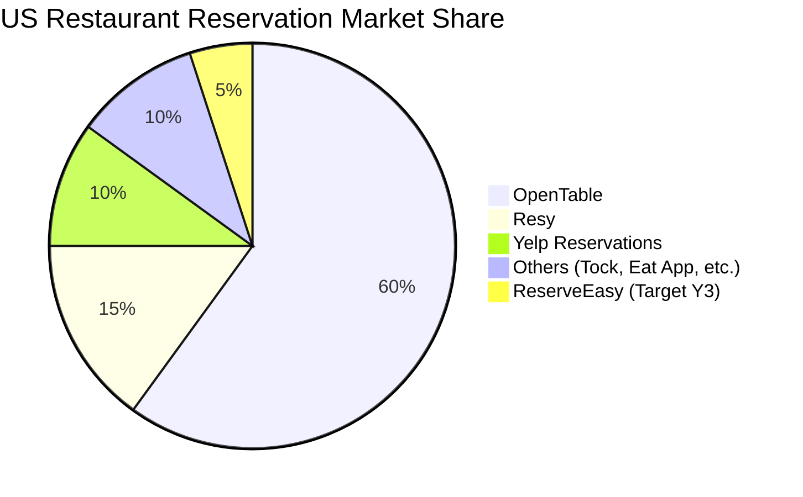
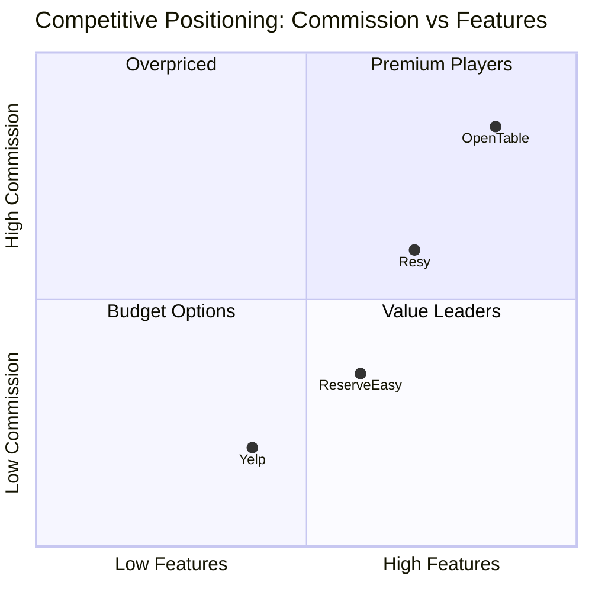

# ReserveEasy Market Analysis

**Author:** Product Team  
**Date:** January 15, 2026  
**Status:** Approved

---

## Executive Summary

ReserveEasy targets the **$13B US restaurant reservation market**, focusing on the underserved **casual dining segment** ($3B). Our competitive advantage: **10% commission** (vs OpenTable's 20%) combined with a **deposit system** that reduces no-shows from 30% to <5%.

**Market Opportunity:** $17B lost annually to no-shows. We capture value by solving this pain point.

---

## Market Sizing (TAM/SAM/SOM)

### Total Addressable Market (TAM)

**$13 billion** - Total US spending on reservation platforms annually

**Calculation:**

- 660,000 restaurants in the US
- 40% accept reservations = 264,000 restaurants
- Average restaurant revenue: $500k/year
- Average booking-driven revenue: 60% = $300k
- Platform take rate: 15% = $45k/restaurant
- TAM: 264,000 × $45k = **$11.88B** ≈ $13B

---

### Serviceable Available Market (SAM)

**$3 billion** - Casual dining segment (our target)

**Segmentation:**

- Fine dining: 20% of market ($2.6B) → Dominated by OpenTable
- Casual dining: 50% of market ($6.5B) → **Our focus**
- Fast casual: 30% of market ($3.9B) → Less need for reservations

**Why casual dining?**

- High volume (more bookings = more revenue)
- Price-sensitive (open to lower-commission platforms)
- Tech adoption growing post-COVID

---

### Serviceable Obtainable Market (SOM)

**$50 million** - Year 1 target (NYC only)

**Assumptions:**

- Launch in NYC metro area: 25,000 restaurants
- Target 500 restaurants in Year 1 (2% penetration)
- Average bookings/restaurant/month: 200
- Average booking value: $40/person × 3 party size = $120
- Commission: 10%
- Revenue/booking: $12
- Annual revenue: 500 restaurants × 200 bookings × 12 months × $12 = **$14.4M gross booking value**
- Our revenue: $1.44M

**Year 3 Goal:** $50M (expand to 5 cities)

---

## Competitive Analysis

### Market Share (2026)

---

### Competitive Matrix

| Feature                    | OpenTable          | Resy                    | Yelp Reservations | **ReserveEasy**               |
| -------------------------- | ------------------ | ----------------------- | ----------------- | ----------------------------- |
| **Founded**                | 1998               | 2014                    | 2017              | 2026 (new)                    |
| **Target Segment**         | Fine dining        | Trendy restaurants      | All categories    | Casual dining                 |
| **Commission**             | 15-20%             | 10-15%                  | Free + upsell     | **10%**                       |
| **Deposit System**         | ❌ No              | Limited (high-end only) | ❌ No             | ✅ Yes (parties 6+)           |
| **SMS Confirmation**       | ✅ Yes             | ✅ Yes                  | ❌ No             | ✅ Yes                        |
| **Real-Time Availability** | ✅ Yes             | ✅ Yes                  | ✅ Yes            | ✅ Yes                        |
| **Analytics Dashboard**    | ✅ Advanced (paid) | Basic                   | Basic             | ✅ Focused on no-shows        |
| **POS Integration**        | ✅ Yes             | Limited                 | ❌ No             | ❌ No (v3.0)                  |
| **Mobile App**             | ✅ iOS/Android     | ✅ iOS/Android          | ✅ Yes            | ❌ No (mobile web only in v1) |
| **Market Share**           | 60%                | 15%                     | 10%               | 0%                            |

---

### Competitive Positioning

**Our Positioning:** **Value Leader** - Good features, low commission

---

### SWOT Analysis

| **Strengths** (Internal +)                 | **Weaknesses** (Internal -)        |
| ------------------------------------------ | ---------------------------------- |
| ✅ 50% lower commission than OpenTable     | ❌ Zero market share (new entrant) |
| ✅ Deposit system (unique differentiation) | ❌ No restaurant network yet       |
| ✅ Focused niche (casual dining)           | ❌ No brand awareness              |
| ✅ Modern tech stack (faster iteration)    | ❌ Small team (6 engineers)        |

| **Opportunities** (External +)                          | **Threats** (External -)                  |
| ------------------------------------------------------- | ----------------------------------------- |
| 🚀 $17B lost to no-shows (huge pain point)              | ⚠️ OpenTable could slash prices to defend |
| 🚀 COVID accelerated digital adoption                   | ⚠️ Economic recession = fewer diners      |
| 🚀 Gen Z prefers apps over phone calls (65% of diners)  | ⚠️ Restaurants might build in-house       |
| 🚀 Potential partnership with delivery apps (Uber Eats) | ⚠️ Data privacy regulations (GDPR, CCPA)  |

---

## Porter's Five Forces Analysis

### 1. Threat of New Entrants: **MODERATE**

**Barriers to Entry:**

- Low: Building tech is easy (AWS, Stripe, Twilio = commoditized)
- High: Network effects (need restaurants AND diners - chicken-egg problem)

**Our Moat:** First-mover in casual dining + restaurant relationships

---

### 2. Bargaining Power of Suppliers: **LOW**

**Suppliers:**

- SMS: Twilio, Nexmo, MessageBird (many options)
- Payments: Stripe, Square, Braintree (many options)
- Hosting: AWS, GCP, Azure (many options)

**Impact:** Easy to switch if prices rise

---

### 3. Bargaining Power of Buyers: **HIGH**

**Buyers = Restaurants:**

- Can multi-home (use OpenTable AND ReserveEasy)
- Low switching cost
- Price-sensitive (10% commission is meaningful on $500k revenue)

**Mitigation:** Make our platform indispensable (best analytics, highest show-up rate)

---

### 4. Threat of Substitutes: **MODERATE**

**Alternatives:**

- Phone bookings (traditional, still 40% of market)
- Walk-ins (spontaneous diners)
- Direct booking on restaurant website

**Trend:** Phone declining 10%/year as younger demographics prefer digital

---

### 5. Competitive Rivalry: **HIGH**

- OpenTable has 60% share → Will defend aggressively
- Price wars likely if we gain traction
- Differentiation required (not just cheaper, but BETTER on specific dimension)

**Our Strategy:** Win on no-show reduction → Prove ROI to restaurants

---

## Customer Segmentation

### Primary Persona 1: Urban Diner Sarah

**Demographics:**

- Age: 28
- Occupation: Marketing Manager
- Income: $85k/year
- Location: Manhattan

**Behaviors:**

- Dines out 3x/week
- Uses apps for everything (Uber, Seamless, ClassPass)
- Plans social events for friend group

**Pain Points:**

- Calling restaurants wastes 10 minutes during work hours
- No confirmation → anxiety ("Did they write it down?")
- Can't modify reservations easily (have to call back)

**Jobs to Be Done:**

- "When planning dinner, I want guaranteed seating so I avoid embarrassment if we don't get a table"
- "When my plans change, I want to modify easily so I don't lose my spot"

**What She Values:**

- Speed (<60 seconds to book)
- Confirmation (proof it worked)
- Flexibility (easy changes)

**Full Persona:** [User Personas](user-personas.md)

---

### Primary Persona 2: Restaurant Manager Raj

**Demographics:**

- Age: 42
- Role: General Manager, 50-seat bistro in Brooklyn
- Revenue: $500k/year, $200k profit
- Challenge: 30% no-show rate = $60k lost revenue/year

**Pain Points:**

- Phone interruptions during dinner rush (can't answer, miss bookings)
- No way to enforce no-show penalties
- Lost revenue from empty tables (can't fill last-minute)

**Jobs to Be Done:**

- "When managing my floor, I want to maximize table turnover so I increase revenue"
- "When a customer no-shows, I want to minimize financial impact"

**What He Values:**

- Reduced no-shows (direct profit impact)
- Operational efficiency (less phone time)
- Data visibility (peak hours, party sizes for staffing)

---

## Market Trends

### Trend 1: Digital-First Diners

**Data:**

- 65% of Gen Z/Millennials prefer online booking over phone
- Mobile traffic: 78% of restaurant discovery happens on mobile

**Implication:** Mobile-responsive web app is sufficient for v1.0

---

### Trend 2: No-Show Crisis Post-COVID

**Data:**

- Industry no-show rate: 30% (up from 20% pre-COVID)
- Contributing factors: Over-booking across platforms, less commitment

**Implication:** Our deposit system directly addresses the #1 pain point

---

### Trend 3: Data-Driven Restaurants

**Data:**

- 58% of restaurants now use analytics tools (up from 35% in 2019)
- Demand growing for customer insights, peak hour analysis

**Implication:** Our analytics dashboard is a retention driver

---

## Go-to-Market Strategy

### Phase 1: NYC Launch (Year 1)

**Target:** 500 casual dining restaurants

**Tactics:**

1. **Direct Sales:** Hire 3 restaurant account executives
2. **Free Trial:** First 100 bookings free (prove ROI risk-free)
3. **SEO/Paid Ads:** Target "NYC restaurant reservations" keywords
4. **Partnerships:** Integrate with NYC food bloggers, Infatuation, Eater

---

### Phase 2: Multi-City Expansion (Year 2-3)

**Cities:** SF, LA, Chicago, Boston (high density, tech-savvy)

**By Year 3:**

- 2,500 restaurants
- 500k monthly active diners
- $50M GMV

---

## Key Metrics to Track

| Metric                    | Target (Year 1) | How to Measure                                                                                |
| ------------------------- | --------------- | --------------------------------------------------------------------------------------------- |
| Restaurants Onboarded     | 500             | Sales CRM                                                                                     |
| Monthly Active Bookers    | 15,000          | `SELECT COUNT(DISTINCT user_id) FROM bookings WHERE created_at >= NOW() - INTERVAL '30 days'` |
| Booking Conversion Rate   | 20%             | (Bookings / Restaurant Page Views) × 100                                                      |
| No-Show Rate              | <5%             | `SELECT AVG(no_show) FROM bookings`                                                           |
| Customer Acquisition Cost | <$30            | Marketing Spend / New Users                                                                   |
| Net Promoter Score        | >40             | Post-booking survey                                                                           |

---

## Conclusion

**Market Opportunity:** Large ($13B), growing (10% CAGR), with a clear pain point ($17B lost to no-shows).

**Competitive Advantage:** Lower commission + deposit system + casual dining focus.

**Risks:** High buyer power, competitive rivalry. Mitigation: Prove undeniable ROI.

**Go-Forward:** Launch NYC with 50 pilot restaurants, prove unit economics, then scale.

---

[← Back to Project](../README.md) | [User Personas →](user-personas.md) | [Opportunity Tree →](opportunity-tree.md)
