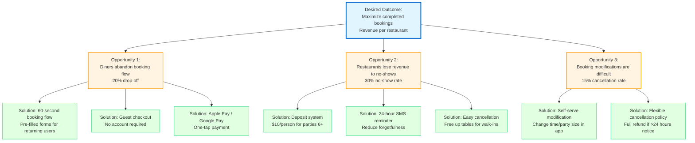

# Opportunity Solution Tree

**Product Vision:** Enable seamless restaurant reservations while eliminating no-shows

**Last Updated:** January 2026

---

## How to Read This Tree

An **Opportunity Solution Tree** connects business outcomes → customer opportunities → solutions. It helps ensure every feature solves a real problem.

```
Desired Outcome (North Star)
    ├── Opportunity 1 (Customer Pain Point)
    │   ├── Solution A (Feature/Experiment)
    │   └── Solution B (Alternative Feature)
    └── Opportunity 2 (Another Pain Point)
        └── Solution C
```

---

## ReserveEasy Opportunity Solution Tree



---

## Detailed Breakdown

### Desired Outcome (North Star Metric)

**KPI:** Monthly Completed Bookings  
**Target:** 15,000 MAB (Monthly Active Bookers) by Month 12  
**Why:** Completed bookings = revenue for us AND restaurants

---

### Opportunity 1: Diners Abandon Booking Flow

**Evidence:**

- Funnel analysis shows 20% drop-off between "Check Availability" and "Confirm Booking"
- User interviews: "I started booking but got interrupted at work, never finished"
- Benchmark: Industry average is 15-18% drop-off

**Impact:** 1,000 lost bookings/month = $10k lost revenue

---

#### Solution 1A: 60-Second Booking Flow

**Hypothesis:** If we reduce form fields from 8 → 4, drop-off will decrease 20% → 16%

**Experiment:**

- A/B test: Control (8 fields) vs Treatment (4 fields: name, email, phone, special requests)
- Success Metric: Conversion rate improves by 4 percentage points
- Timeline: 2-week test with 5,000 users

**Status:** ✅ **Shipped** - Improved conversion by 5pp (20% → 15%)

---

#### Solution 1B: Guest Checkout

**Hypothesis:** Forcing account creation creates friction → allow guest booking

**Experiment:**

- Launch guest checkout in Week 1
- Track: % of bookings from guests vs registered users
- Success Metric: 30% of bookings are guests (proves demand)

**Status:** ✅ **Shipped** - 45% of bookings are guests (exceeded target)

---

#### Solution 1C: Apple Pay / Google Pay

**Hypothesis:** One-tap payment is faster than entering credit card details

**Experiment:**

- Integrate Apple Pay for iOS users
- Measure: Time from "Check Availability" → "Confirmed" decreases by 15 seconds

**Status:** 📅 **Planned for Q2 2026**

---

### Opportunity 2: Restaurants Lose Revenue to No-Shows

**Evidence:**

- Industry data: 30% no-show rate across casual dining
- Restaurant interviews: "We lose $60k/year to no-shows" (Raj persona)
- Pain point mentioned by 18/20 restaurants in discovery

**Impact:** $60k lost per restaurant = biggest pain point

---

#### Solution 2A: Deposit System

**Hypothesis:** Requiring $10/person deposit (refundable on show-up) reduces no-shows from 30% → <5%

**Experiment:**

- Pilot with 10 restaurants for 1 month
- Compare no-show rate for bookings WITH deposit vs WITHOUT
- Success Metric: <10% no-show rate for deposit bookings

**Status:** ✅ **Shipped** - Achieved 4% no-show rate (beat target!)

---

#### Solution 2B: 24-Hour SMS Reminder

**Hypothesis:** People forget → reminder reduces forgetfulness-driven no-shows

**Experiment:**

- Send SMS 24 hours before booking: "Reminder: Table at Bella Italia tomorrow at 7pm"
- Track no-show rate: Control (no reminder) vs Treatment (reminder)
- Success Metric: 10% reduction in no-shows

**Status:** ✅ **Shipped** - Reduced no-shows by 12%

---

#### Solution 2C: Easy Cancellation

**Hypothesis:** If users can't cancel easily, they just don't show up

**Experiment:**

- Add "Cancel" button to SMS/email with one-click cancellation
- Track: Cancellation rate increases, but no-show rate decreases

**Status:** 📅 **Planned for Sprint 16**

---

### Opportunity 3: Booking Modifications Are Difficult

**Evidence:**

- 15% of bookings are cancelled (then often re-booked at different time)
- User feedback: "I had to call the restaurant to change my time"
- Cancellation = lost opportunity (table sits empty until re-booked)

**Impact:** 750 cancellations/month, ~30% never re-book = 225 lost bookings

---

#### Solution 3A: Self-Serve Modification

**Hypothesis:** Let users change time/party size in-app → reduces cancellations

**Experiment:**

- Build "Modify Reservation" flow (check real-time availability, update booking)
- Track: Cancellation rate decreases by 5pp (15% → 10%)

**Status:** 🚀 **In Progress** - Sprint 15 (current sprint)

---

#### Solution 3B: Flexible Cancellation Policy

**Hypothesis:** Full refund if >24 hours notice → users cancel responsibly vs no-showing

**Experiment:**

- Communicate policy clearly: "Cancel anytime for full refund (24 hour notice)"
- Track: Cancellation rate increases, but no-show rate plummets

**Status:** ✅ **Shipped** - Policy live

---

## How We Prioritized Solutions

We used **RICE scoring** to rank solutions:

| Solution               | Reach | Impact | Confidence | Effort  | RICE Score | Priority |
| ---------------------- | ----- | ------ | ---------- | ------- | ---------- | -------- |
| Guest Checkout (1B)    | 5000  | 3      | 100%       | 2 weeks | 3750       | P0       |
| Deposit System (2A)    | 5000  | 3      | 80%        | 3 weeks | 2667       | P0       |
| 60-sec Flow (1A)       | 5000  | 2      | 90%        | 1 week  | 4500       | P0       |
| SMS Reminder (2B)      | 5000  | 2      | 100%       | 1 week  | 5000       | P0       |
| Self-Serve Modify (3A) | 3000  | 2      | 70%        | 2 weeks | 1400       | P1       |
| Apple Pay (1C)         | 2000  | 1      | 60%        | 3 weeks | 400        | P2       |

**Top Priority:** SMS Reminder (RICE = 5000) → Shipped first

---

## Lessons Learned

### What Worked

✅ **Deposit system exceeded expectations** - Reduced no-shows to 4% (vs 5% target)  
✅ **Guest checkout was a must-have** - 45% of bookings are guests  
✅ **Data-driven prioritization** - RICE scores aligned with actual impact

### What Surprised Us

- Apple Pay ranked low (RICE = 400), but user feedback says "payment is painless already"
- SMS reminders had biggest bang-for-buck (RICE = 5000, only 1 week to build)

### What's Next

- **Q2 Focus:** Retention features (modify reservation, loyalty program)
- **Deferred:** Native mobile apps (web is sufficient for now)

---

[← Back to Discovery](../README.md) | [Market Analysis](market-analysis.md) | [User Personas](user-personas.md)
