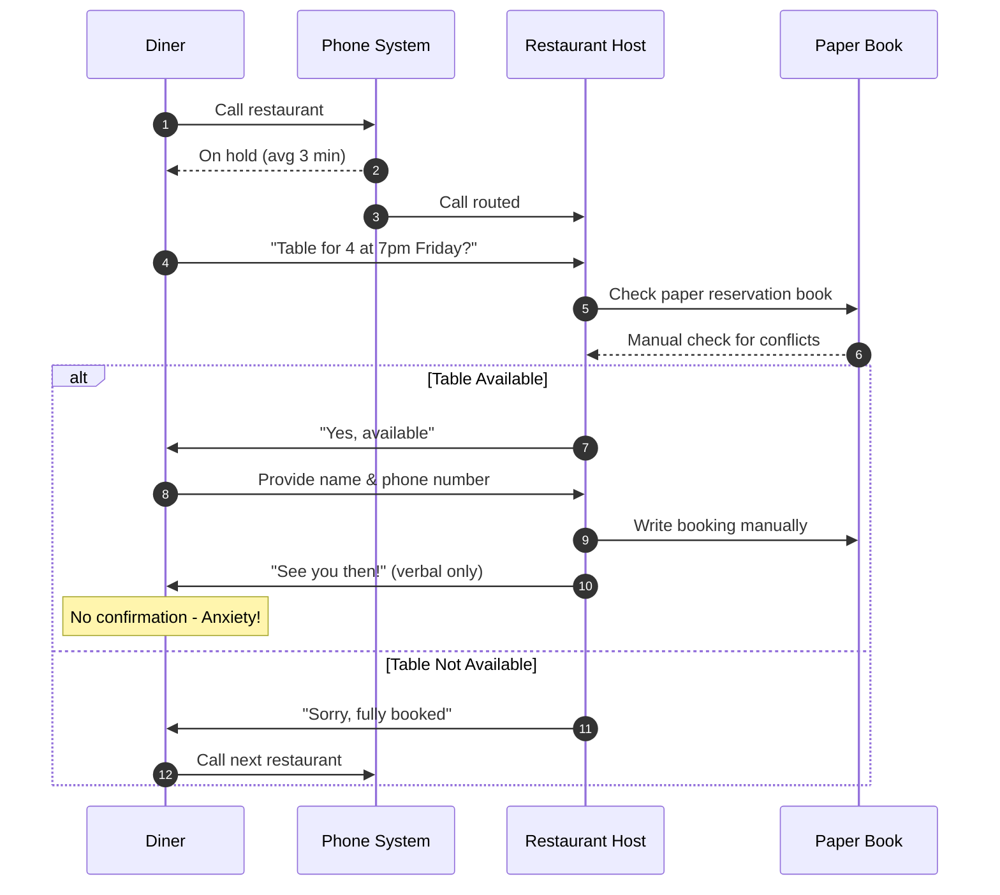
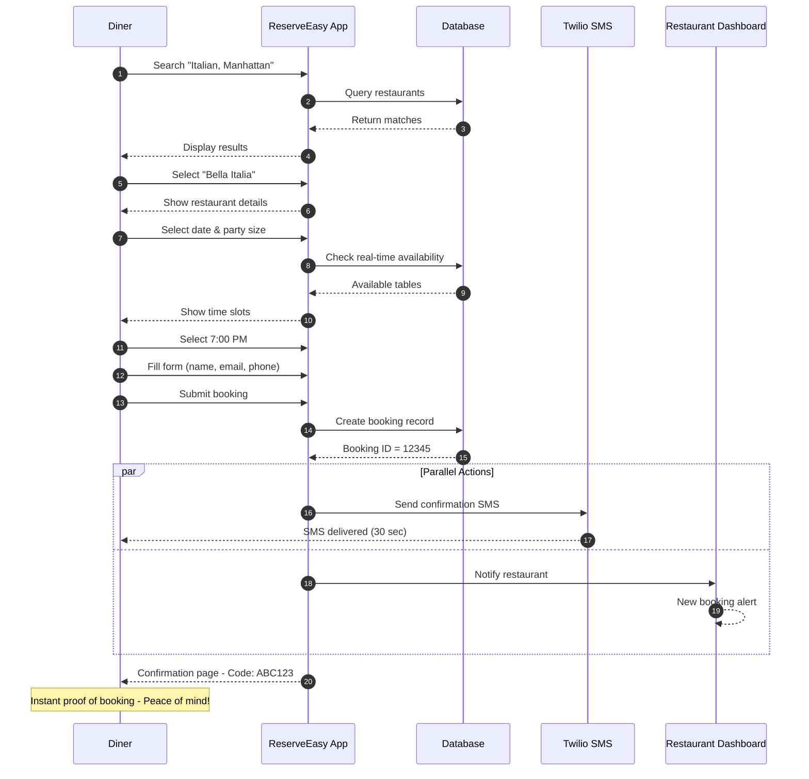
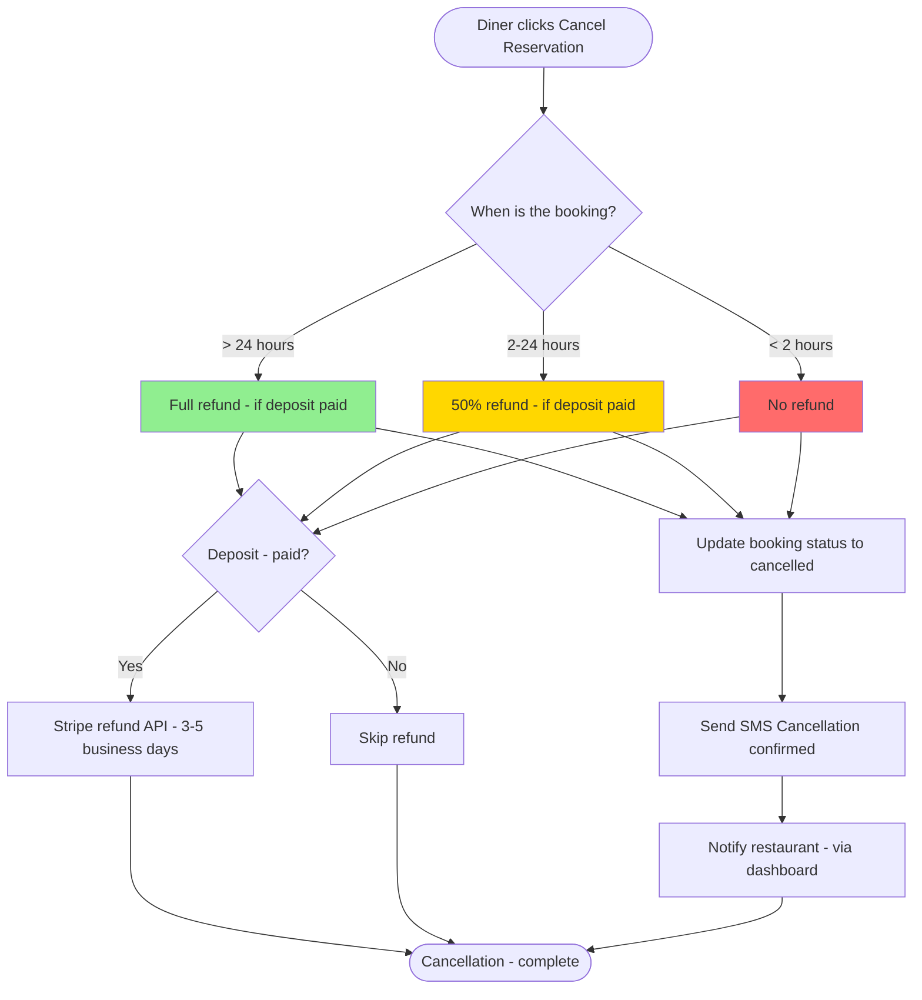
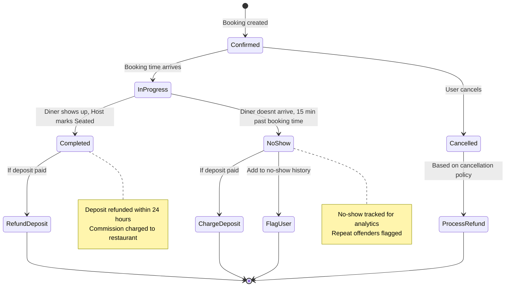

# Process Maps - ReserveEasy

**Purpose:** Visualizing user flows and system interactions using Business Process Model and Notation (BPMN).

---

## Table of Contents

1. [Booking Flow - As-Is (Phone Booking)](#booking-flow---as-is)
2. [Booking Flow - To-Be (Reserve Easy Platform)](#booking-flow---to-be)
3. [Cancellation Flow](#cancellation-flow)
4. [Restaurant Confirmation Workflow](#restaurant-confirmation-workflow)

---

## Booking Flow - As-Is (Phone Booking)

**Current State:** How diners book tables today (before ReserveEasy)

**Pain Points:**

- ⏱️ **5-10 minute process** (hold time + conversation)
- 📵 **No confirmation** → diner anxiety
- 🚫 **Host interrupted** during dinner rush
- 📊 **No data** captured for analytics

---

## Booking Flow - To-Be (ReserveEasy Platform)

**Future State:** How reservations work with ReserveEasy

**Improvements:**

- ⚡ **60 seconds total** (vs 5-10 minutes)
- ✅ **SMS confirmation** within 30 seconds
- 📊 **Real-time availability** (no double-bookings)
- 📈 **Analytics captured** automatically

---

## Cancellation Flow

**User Story:** As a diner, I want to cancel my reservation so I can free up the table if my plans change.

**Business Rules:**

- Cancellations **>24 hours before:** Full refund
- Cancellations **2-24 hours before:** 50% refund
- Cancellations **<2 hours before:** No refund (penalize last-minute cancellations)

---

## Restaurant Confirmation Workflow

**Use Case:** Restaurant host marks a booking as "completed" or "no-show"

**State Transitions:**

1. **Confirmed** → Booking created, awaiting arrival
2. **In Progress** → Booking time has arrived (within 15-min window)
3. **Completed** → Diner showed up, deposit refunded, commission charged
4. **No-Show** → Diner didn't arrive, deposit kept, restaurant compensated
5. **Cancelled** → User cancelled before booking time

---

## SMS Notification Flow

**Purpose:** Ensure users receive timely confirmations and reminders

```mermaid
gantt
    title SMS Notification Timeline
    dateFormat HH:mm
    axisFormat %H:%M

    section Booking Day
    User submits booking           :milestone, 09:00, 0m
    Immediate SMS confirmation     :crit, 09:00, 1m

    section Day Before
    24-hour reminder SMS           :done, 19:00, 1m

    section Booking Day
    2-hour reminder SMS            :active, 17:00, 1m
    Booking time (7pm)             :milestone, 19:00, 0m
```

**SMS Types:**

1. **Instant Confirmation** (within 30 sec of booking)
2. **24-Hour Reminder** (day before at 7 PM)
3. **2-Hour Reminder** (2 hours before booking)

---

## Key Metrics from Process Maps

| Process                 | As-Is (Phone)     | To-Be (ReserveEasy)  | Improvement          |
| ----------------------- | ----------------- | -------------------- | -------------------- |
| **Time to Book**        | 5-10 minutes      | 60 seconds           | 83-90% faster        |
| **Confirmation Method** | Verbal only       | SMS + Email          | Instant proof        |
| **No-Show Rate**        | 30%               | <5% (deposit system) | 83% reduction        |
| **Host Interruptions**  | ~20/evening       | 0 (automated)        | 100% reduction       |
| **Data Captured**       | None (paper book) | Full analytics       | Infinite improvement |

---

[← Back to Project](../README.md) | [Discovery →](../01-discovery/) | [Specs →](../02-specs/)
