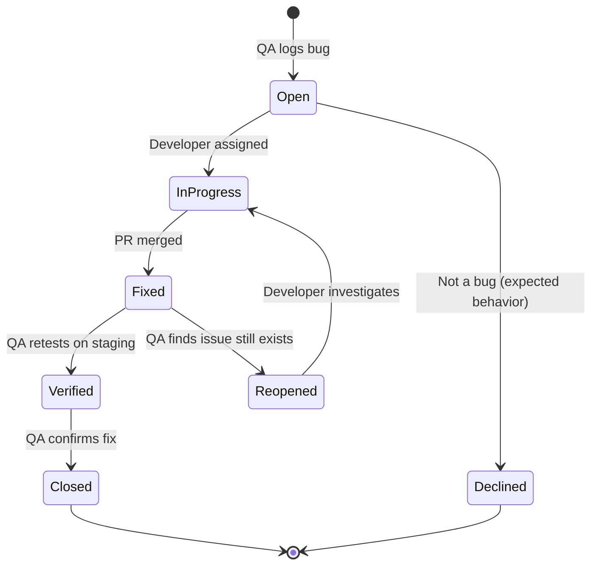

# Master Test Plan

**Project:** ReserveEasy MVP  
**Version:** 1.0  
**Test Manager:** QA Lead  
**Last Updated:** February 1, 2026

---

## 1. Introduction

### Purpose

This Master Test Plan defines the testing strategy, scope, resources, and schedule for the ReserveEasy MVP launch.

### Scope

**In-Scope:**

- Web application (mobile-responsive)
- Booking flow (guest and registered users)
- Payment processing (Stripe integration)
- SMS notifications (Twilio integration)
- Restaurant dashboard

**Out-of-Scope:**

- Native mobile apps (iOS/Android) - deferred to v2.0
- Third-party integrations (POS systems) - future consideration

---

## 2. Test Strategy

### Testing Pyramid

```
┌─────────────────────────────────┐
│  Manual / Exploratory (5%)      │  ← QA Team
├─────────────────────────────────┤
│  UI / E2E Tests (15%)            │  ← Automated (Cypress)
├─────────────────────────────────┤
│  Integration Tests (30%)         │  ← Automated (Jest)
├─────────────────────────────────┤
│  Unit Tests (50%)                │  ← Developers (Jest)
└─────────────────────────────────┘
```

**Philosophy:** Automate the base, manually test the critical paths.

---

### Test Types

| Type                  | Coverage                        | Responsibility  | Tools           |
| --------------------- | ------------------------------- | --------------- | --------------- |
| **Unit Tests**        | 80% code coverage               | Developers      | Jest, Mocha     |
| **Integration Tests** | API endpoints, database         | Developers + QA | Postman, Jest   |
| **System Tests**      | End-to-end user flows           | QA              | Cypress, Manual |
| **UAT**               | Real-world scenarios            | Stakeholders    | Manual          |
| **Performance Tests** | Load, stress testing            | DevOps          | k6, JMeter      |
| **Security Tests**    | Penetration, vulnerability scan | Security Team   | OWASP ZAP       |

---

## 3. Test Scope

### Functional Testing

#### Feature: Booking Creation (Guest)

- [ ] Search restaurants by cuisine and location
- [ ] View restaurant details (photos, hours, menu)
- [ ] Check real-time availability
- [ ] Complete booking form (name, email, phone)
- [ ] Receive SMS confirmation within 30 seconds
- [ ] View confirmation page with booking code

**Test Cases:** TC-001 through TC-015

---

#### Feature: Booking Modification

- [ ] Change reservation time (if >2 hours away)
- [ ] Increase/decrease party size
- [ ] Adjust deposit automatically based on party size
- [ ] Receive updated SMS confirmation

**Test Cases:** TC-MOD-001 through TC-MOD-010

---

#### Feature: Payment Processing

- [ ] Collect $10/person deposit for parties of 6+
- [ ] Validate credit card via Stripe
- [ ] Process refund if booking cancelled >24 hours before
- [ ] Partial refund for cancellations 2-24 hours before
- [ ] No refund for cancellations <2 hours before

**Test Cases:** TC-PAY-001 through TC-PAY-020

---

### Non-Functional Testing

#### Performance Requirements

| Metric              | Target                      | Test Method             |
| ------------------- | --------------------------- | ----------------------- |
| Page Load Time      | <2 seconds (4G)             | Lighthouse, WebPageTest |
| API Response Time   | <500ms (p95)                | k6 load testing         |
| Concurrent Users    | 1,000 simultaneous bookings | Load test with k6       |
| Database Query Time | <100ms (p95)                | New Relic APM           |

---

#### Security Requirements

- [ ] HTTPS only (no HTTP)
- [ ] PCI DSS Level 1 compliant (Stripe handles card data)
- [ ] SQL injection prevention (parameterized queries)
- [ ] XSS prevention (sanitize user inputs)
- [ ] CSRF tokens on all forms
- [ ] Rate limiting (max 10 requests/second per IP)

**Test Method:** OWASP ZAP automated scan + manual penetration test

---

#### Usability Requirements

- [ ] Mobile-responsive (iPhone SE, iPad, Desktop)
- [ ] WCAG 2.1 AA accessibility compliance
- [ ] Browser compatibility: Chrome, Safari, Firefox, Edge (latest 2 versions)

---

## 4. Entry & Exit Criteria

### Entry Criteria (Before Testing Begins)

- [ ] Code deployed to staging environment
- [ ] Unit tests passing (>80% coverage)
- [ ] Test data seeded (50 restaurants, 1,000 sample users)
- [ ] Test environment stable (no P0 bugs from previous sprint)
- [ ] Test cases reviewed and approved by PM

---

### Exit Criteria (Testing Complete)

- [ ] All P0 test cases pass
- [ ] Zero P0 bugs, zero P1 bugs
- [ ] P2/P3 bugs documented (can be fixed post-launch)
- [ ] UAT sign-off from stakeholders
- [ ] Performance benchmarks met
- [ ] Security audit passed

---

## 5. Test Environment

### Staging Environment

**URL:** `https://staging.reserveeasy.com`

**Infrastructure:**

- Database: PostgreSQL 14 (copy of production schema, sanitized data)
- Backend: Node.js 18, Express
- Frontend: React 18, deployed on AWS S3 + CloudFront
- SMS: Twilio sandbox mode (test phone numbers only)
- Payments: Stripe test mode (test card: 4242 4242 4242 4242)

**Data:**

- 50 test restaurants (covering all cuisines, price ranges)
- 1,000 test users (mix of guests and registered)
- Historical bookings (to test analytics queries)

---

## 6. Test Data

### Valid Test Data

| Field       | Value                                  |
| ----------- | -------------------------------------- |
| Name        | Test User                              |
| Email       | test@example.com                       |
| Phone       | +15551234567 (Twilio verified)         |
| Credit Card | 4242 4242 4242 4242 (Stripe test card) |
| CVV         | 123                                    |
| Expiry      | 12/28                                  |

---

### Invalid Test Data (For Negative Testing)

| Scenario        | Value               | Expected Result                         |
| --------------- | ------------------- | --------------------------------------- |
| Invalid email   | "notanemail"        | Error: "Invalid email format"           |
| Phone too short | "123"               | Error: "Phone number must be 10 digits" |
| Past date       | Yesterday's date    | Error: "Cannot book in the past"        |
| Card declined   | 4000 0000 0000 0002 | Error: "Payment declined"               |

---

## 7. Defect Management

### Severity Classification

| Severity          | Definition                                  | SLA to Fix              |
| ----------------- | ------------------------------------------- | ----------------------- |
| **P0 (Critical)** | System down, no bookings possible           | Hotfix within 2 hours   |
| **P1 (High)**     | Major feature broken, affects many users    | Fix in current sprint   |
| **P2 (Medium)**   | Feature partially broken, workaround exists | Fix in next 1-2 sprints |
| **P3 (Low)**      | Cosmetic, minimal impact                    | Backlog                 |

---

### Defect Workflow



---

## 8. Test Schedule

| Phase                   | Start Date | End Date | Owner           |
| ----------------------- | ---------- | -------- | --------------- |
| **Unit Testing**        | Ongoing    | Ongoing  | Developers      |
| **Integration Testing** | Feb 1      | Feb 5    | Developers + QA |
| **System Testing**      | Feb 6      | Feb 10   | QA Team         |
| **UAT**                 | Feb 11     | Feb 13   | Stakeholders    |
| **Performance Testing** | Feb 14     | Feb 15   | DevOps          |
| **Security Audit**      | Feb 14     | Feb 16   | Security Team   |
| **Launch**              | Feb 17     | Feb 17   | All             |

---

## 9. Roles & Responsibilities

| Role              | Responsibility                           | Team Member        |
| ----------------- | ---------------------------------------- | ------------------ |
| **Test Manager**  | Overall test strategy, reporting         | Sam (QA Lead)      |
| **QA Engineers**  | Write/execute test cases, log bugs       | QA Team (3 people) |
| **Developers**    | Fix bugs, write unit/integration tests   | Engineering Team   |
| **Product Owner** | UAT sign-off, prioritize bugs            | PM                 |
| **DevOps**        | Performance testing, staging environment | DevOps Team        |

---

## 10. Risks & Mitigation

| Risk                         | Impact              | Probability | Mitigation                            |
| ---------------------------- | ------------------- | ----------- | ------------------------------------- |
| Staging environment unstable | Testing delayed     | Medium      | Daily health checks, alerts           |
| Twilio SMS quota exceeded    | Can't test SMS flow | Low         | Use Twilio sandbox, monitor usage     |
| Stripe test mode disabled    | Can't test payments | Low         | Verify Stripe account settings weekly |
| Last-minute feature changes  | Test cases outdated | Medium      | Freeze scope 1 week before testing    |

---

## 11. Test Deliverables

- [ ] Master Test Plan (this document)
- [ ] Test Cases (TC-001 through TC-100+)
- [ ] Test Execution Report (pass/fail summary)
- [ ] Defect Report (all P0-P3 bugs logged)
- [ ] UAT Sign-Off Document
- [ ] Performance Test Results (k6 report)
- [ ] Security Audit Report

---

## 12. Tools

| Category              | Tool      | Purpose                |
| --------------------- | --------- | ---------------------- |
| **Test Management**   | Jira      | Track test cases, bugs |
| **Automated Testing** | Cypress   | E2E UI tests           |
| **API Testing**       | Postman   | Integration tests      |
| **Performance**       | k6        | Load testing           |
| **Security**          | OWASP ZAP | Vulnerability scan     |
| **Monitoring**        | New Relic | APM, error tracking    |

---

## 13. Approval

| Role             | Name | Signature | Date |
| ---------------- | ---- | --------- | ---- |
| QA Lead          |      |           |      |
| Engineering Lead |      |           |      |
| Product Owner    |      |           |      |

---

[← Back to QA](../06-qa/) | [Test Cases →](test-cases/) | [Bug Reports →](bug-reports/)
