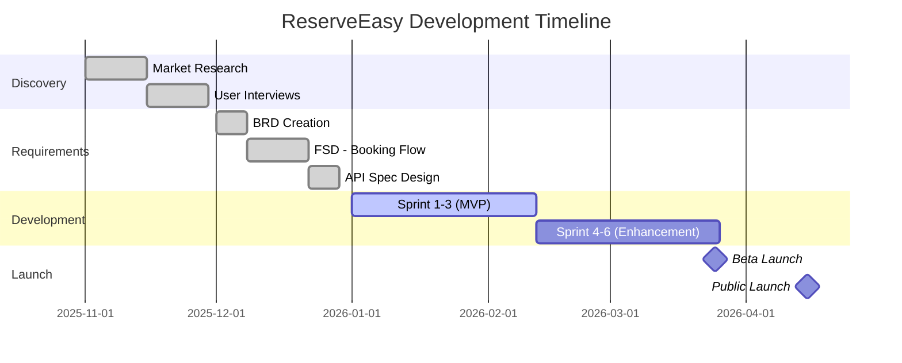

# Reserve Easy Project

## Welcome to ReserveEasy 🍽️

You are now the **Product Manager** for ReserveEasy - a two-sided marketplace connecting diners with restaurants for seamless table reservations.

This folder contains the **complete product lifecycle** - from initial market research through technical implementation to analytics and quality assurance.

---

## The Product

**For Diners:**

- Search restaurants by cuisine, location, price range
- View real-time table availability
- Book in 60 seconds (vs 5 minutes calling)
- Instant SMS confirmation
- Easy modification/cancellation

**For Restaurants:**

- Reduce no-shows from 30% to <5%
- Automated customer communication
- Analytics dashboard (peak hours, popular dishes)
- Fill tables during off-peak hours

---

## The Business Model

**Revenue:** 10% commission on completed bookings

**Example:**

- Average booking value: $50/person × 4 people = $200
- ReserveEasy commission: $200 × 10% = **$20 per booking**
- Target: 10,000 bookings/month = **$200k monthly revenue**

---

## Project Structure

### [📊 01-discovery/](01-discovery/)

_Market research, user personas, opportunity analysis_

**Key Files:**

- [market-analysis.md](01-discovery/market-analysis.md) - 9-Dimension Gap Analysis
- [user-personas.md](01-discovery/user-personas.md) - "Restaurant Manager Raj" & "Busy Diner Sarah"
- [opportunity-tree.md](01-discovery/opportunity-tree.md) - Visualizing business outcomes → solutions

---

### [📐 02-specs/](02-specs/)

_Requirements documentation and technical specifications_

**Key Files:**

- [BRD-v1.0.md](02-specs/BRD-v1.0.md) - Business Requirements Document
- [FSD-booking-mod.md](02-specs/FSD-booking-mod.md) - Functional Specification for booking modifications
- [API-specs/booking-api.yaml](02-specs/API-specs/booking-api.yaml) - **OpenAPI 3.0** specification (code-adjacent!)
- [API-specs/webhooks.md](02-specs/API-specs/webhooks.md) - SMS Gateway integration docs

**Portfolio Highlight:** Show interviewers the `.yaml` file - proves you can work with engineers.

---

### [🎨 03-design/](03-design/)

_Process maps and UI/UX artifacts_

**Key Files:**

- [process-maps.md](03-design/process-maps.md) - **Mermaid sequence diagrams** (User → App → DB → SMS Gateway)
- wireframes/ - Placeholder for Figma/Sketch links

---

### [⚡ 04-delivery/](04-delivery/)

_Agile execution artifacts_

**Key Files:**

- [product-backlog.md](04-delivery/product-backlog.md) - Prioritized user stories with story points
- [sprints/sprint-15-goal.md](04-delivery/sprints/sprint-15-goal.md) - Example sprint commitment

---

### [📊 05-analytics/](05-analytics/)

_Metrics, SQL queries, and data analysis_

**Key Files:**

- [north-star-metric.md](05-analytics/north-star-metric.md) - KPI definitions (Monthly Active Bookers)
- [schema.sql](05-analytics/schema.sql) - **PostgreSQL database schema** (code-adjacent!)
- [queries/funnel_analysis.sql](05-analytics/queries/funnel_analysis.sql) - Track conversion drop-offs
- [queries/retention_cohort.sql](05-analytics/queries/retention_cohort.sql) - Cohort retention analysis
- [queries/ab_test_results.sql](05-analytics/queries/ab_test_results.sql) - Statistical significance testing

**Portfolio Highlight:** Real `.sql` files with syntax highlighting - shows data fluency.

---

### [🛡️ 06-qa/](06-qa/)

_Test plans, test cases, and defect tracking_

**Key Files:**

- [master-test-plan.md](06-qa/master-test-plan.md) - Comprehensive QA strategy
- [test-cases/TC-001-guest-booking.md](06-qa/test-cases/TC-001-guest-booking.md) - Detailed manual test script
- [bug-reports/BUG-234-sms-fail.md](06-qa/bug-reports/BUG-234-sms-fail.md) - Example defect documentation

---

## How to Use This Project

### For Learning

1. **Read the curriculum module first** (e.g., [Module 1: Requirements Engineering](../01-curriculum/01-requirements-engineering.md))
2. **Apply it to ReserveEasy** (e.g., read the [Gap Analysis](01-discovery/market-analysis.md))
3. **Try it yourself** - create artifacts for your own product idea

### For Portfolios

1. **Fork this repository** to your GitHub
2. **Replace ReserveEasy** with your own product (keep the structure)
3. **Show in interviews:** "Here's my BRD, API spec, and SQL queries for market analysis"

### For Practice

1. **Create issues** using [.github templates](../.github/ISSUE_TEMPLATE/)
2. **Submit PRs** with improvements
3. **Practice Git workflows** (branch, commit, review)

---

## The Team (Fictional)

- **Product Manager (You):** Define what to build
- **Engineering Lead (Alex):** Technical architecture
- **Designer (Maya):** UI/UX mockups
- **Data Analyst (Chris):** SQL queries, dashboards
- **QA Lead (Jordan):** Test plans, test cases
- **Stakeholders:** Restaurant owners, investors, exec team

---

## Timeline

---

## Success Metrics

| Metric                       | Baseline       | Target (Year 1) | Current |
| ---------------------------- | -------------- | --------------- | ------- |
| Monthly Active Bookers (MAB) | 0              | 15,000          | TBD     |
| Restaurants Onboarded        | 0              | 500             | TBD     |
| Booking Conversion Rate      | -              | 25%             | TBD     |
| No-Show Rate Reduction       | 30% (industry) | <5%             | TBD     |
| Average Booking Time         | 5 min (phone)  | <60 sec         | TBD     |

---

## What Makes This Real-World?

### 1. Code-Adjacent Documentation

- **API specs in `.yaml`** (not Word docs)
- **SQL queries in `.sql` files** (not screenshots)
- **Diagrams in Mermaid** (version-controlled)

### 2. Realistic Complexity

- Multi-stakeholder (diners + restaurants)
- Real integrations (payment, SMS)
- Edge cases (conflicts, no-shows, refunds)

### 3. Data-Driven

- North Star Metric defined
- SQL queries Written for funnel, cohort, A/B test analysis
- Metrics dashboard specified

---

## Get Started

📖 **Start with:** [Market Analysis](01-discovery/market-analysis.md)

🏗️ **Then review:** [BRD](02-specs/BRD-v1.0.md) → [API Spec](02-specs/API-specs/booking-api.yaml) → [SQL Schema](05-analytics/schema.sql)

🛠️ **Practice:** Create your own product using this structure as a template

---

[← Back to Main](../README.md) | [Curriculum →](../01-curriculum/) | [Toolkit →](../03-toolkit/)
