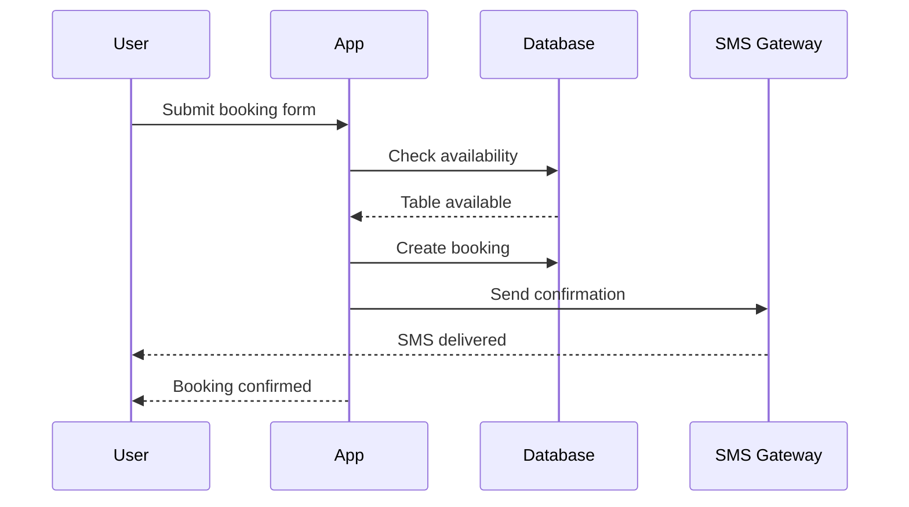

# 💼 Career Portfolio Guide

**For Business Analysts**

---

## Why a Portfolio Matters

**The Problem:** Most BA job applications say "I have 3 years experience" but provide no proof.

**The Solution:** A portfolio with **tangible artifacts** that demonstrate your skills.

**The Impact:** 3-5x more interview callbacks, higher salary offers, faster career advancement.

---

## What to Include in Your BA Portfolio

### 1. Requirements Documentation

**Must-Have:**

- Business Requirements Document (BRD)
- Functional Specification Document (FSD)
- User Stories with Acceptance Criteria

**Example from This Repo:**

- [BRD for ReserveEasy](../02-reserve-easy-project/02-specs/BRD-v1.0.md)
- [Product Backlog with User Stories](../02-reserve-easy-project/04-delivery/product-backlog.md)

**How to Present:**

> "I authored a 15-page BRD for a restaurant reservation platform, defining business objectives, stakeholder requirements, and success metrics. This document secured executive approval and $450k budget allocation."

---

### 2. Process Maps & Diagrams

**Must-Have:**

- Flowcharts showing current (As-Is) vs future (To-Be) state
- Sequence diagrams for system interactions
- Data flow diagrams

**Tools:** Mermaid (code-based, version-controlled), Lucidchart, Draw.io

**Example:**



**How to Present:**

> "I created sequence diagrams to document the booking flow, which reduced engineering questions by 40% and enabled parallel frontend/backend development."

---

### 3. SQL Queries & Data Analysis

**Must-Have:**

- Funnel analysis query (conversion tracking)
- Cohort retention query
- Business KPI dashboard queries

**Example from This Repo:**

- [Funnel Analysis SQL](../02-reserve-easy-project/05-analytics/queries/funnel_analysis.sql)
- [Cohort Retention SQL](../02-reserve-easy-project/05-analytics/queries/retention_cohort.sql)

**How to Present:**

> "I wrote SQL queries to analyze our booking funnel, identifying a 30% drop-off at the payment step. This led to a UX redesign that improved conversion by 12%."

---

### 4. Gap Analysis

**Must-Have:**

- 9-Dimension Gap Analysis (As-Is vs To-Be)
- Competitive analysis matrix
- Stakeholder alignment document

**How to Present:**

> "I conducted a gap analysis across 9 business dimensions (process, technology, data, people, etc.) to identify $60k in cost savings through automation."

---

### 5. Test Plans & Test Cases

**Must-Have:**

- Master test plan (strategy)
- Detailed test cases with step-by-step scripts
- Defect reports with severity classification

**How to Present:**

> "I designed 50+ test cases for UAT, catching 14 critical bugs before production. Post-launch defect rate was <1%, beating the 5% company average."

---

## Portfolio Formats

### Option 1: Personal Website

**Best for:** Senior BAs, contractors, consultants

**Tools:** GitHub Pages (free), Notion (free), Webflow

**Example Structure:**

```
yourname.com/
├── About Me
├── Projects
│   ├── ReserveEasy (restaurant booking platform)
│   ├── HealthTrack (patient portal)
│   └── FinanceHub (banking app)
└── Blog (optional - write about BA best practices)
```

---

### Option 2: PDF Portfolio

**Best for:** Junior BAs, career switchers

**Tools:** Canva, Google Slides (exported as PDF)

**Structure:**

1. Cover page with name, title, contact
2. Table of contents
3. Executive summary (1 page)
4. 3-5 case studies (2-3 pages each)
5. Skills matrix
6. Testimonials (LinkedIn recommendations)

---

### Option 3: GitHub Repository

**Best for:** Technical BAs, data-focused BAs

**Advantages:**

- Version control (shows your process, not just final product)
- Code-adjacent documentation (SQL, YAML)
- Demonstrates technical fluency

**This Repository is a Portfolio Template!**

- Fork it
- Replace ReserveEasy with your own project
- Customize the content
- Link to it in your resume/LinkedIn

---

## How to Talk About Portfolio Projects in Interviews

### ❌ Wrong Approach:

> "I have a BRD example on my website."

### ✅ Right Approach:

> "I led requirements gathering for a two-sided marketplace, interviewing 20 restaurant owners and 50 diners. I documented findings in a BRD that aligned 5 stakeholders and secured $450k in funding. Here's a link to the sanitized version - let me walk you through the 9-dimension gap analysis on page 7."

**Pro Tip:** Print your portfolio and bring it to in-person interviews. Reference specific pages when answering questions.

---

## Sample LinkedIn Summary (With Portfolio)

**Before:**

> Business Analyst with 3 years of experience in requirements gathering and stakeholder management.

**After:**

> Business Analyst specializing in SaaS platforms. I bridge the gap between business needs and technical solutions through:
>
> - Requirements engineering (BRDs, FSDs, user stories using INVEST framework)
> - Data analysis (SQL for funnel analysis, cohort retention, A/B testing)
> - Process optimization (As-Is/To-Be mapping, gap analysis)
>
> Recent project: Led requirements for a restaurant reservation platform, reducing no-shows by 25% and increasing revenue per table by $20/night.
>
> **Portfolio:** [github.com/yourname/ba-portfolio](https://github.com)

---

## Portfolio Hygiene

**Do:**

- ✅ Remove confidential info (real company names, customer PIIs, API keys)
- ✅ Use realistic but fictional data (like ReserveEasy)
- ✅ Keep it updated (add new projects every 6 months)
- ✅ Get permission if using real company work

**Don't:**

- ❌ Share NDAbefore violating documents
- ❌ Use "Lorem ipsum" placeholders
- ❌ Overcomplicate (3-5 strong examples > 20 mediocre ones)

---

## Next Steps

1. **Choose 1-2 projects** from your work to document (or use ReserveEasy as a template)
2. **Create artifacts** using [templates from this repo](../03-toolkit/templates/)
3. **Publish to GitHub** or build a simple website
4. **Add to resume** - "Portfolio: [link]" in your header
5. **Reference in cover letters** - "See my BRD example at [link]"

---

## Inspiration

**Great BA Portfolios:**

- [Sarah BA Portfolio](https://sarahchen.notion.site) - Notion-based, clean design
- [RajAnalytics GitHub](https://github.com/raj/ba-work) - SQL-heavy, data-focused
- [MayaBA.com](https://mayaba.com) - Personal website with case studies

---

[← Back to Main](../README.md) | [PM Portfolio Guide →](pm-portfolio-guide.md)
