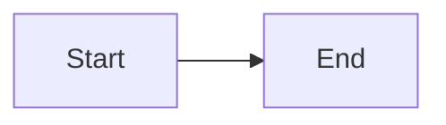

# Contributing to PM & BA Lifecycle Playbook

Thank you for your interest in contributing! This repository is designed as an educational resource, and we welcome improvements from the community.

---

## How to Contribute

### 1. **Report Issues**

Found a typo, broken link, or incorrect information? [Open an issue](../../issues/new/choose) using one of our templates:

- Bug Report (for errors, broken links)
- Feature Request (for new content suggestions)

---

### 2. **Improve Existing Content**

**What we're looking for:**

- Fixing typos and grammatical errors
- Adding practical examples to curriculum modules
- Improving code comments in SQL/YAML files
- Adding Mermaid diagrams to visualize concepts
- Updating outdated information (e.g., industry statistics, tool versions)

**Process:**

1. Fork the repository
2. Create a branch: `git checkout -b fix/update-sql-query`
3. Make your changes
4. Test locally (preview markdown, run SQL queries)
5. Submit a Pull Request with a clear description

---

### 3. **Add New Content**

**We're especially interested in:**

- Real-world case studies (similar to ReserveEasy)
- Additional SQL query patterns (cohort analysis variants, etc.)
- Template improvements (test cases, user stories)
- Exercises at the end of curriculum modules

**Before adding major content:**

1. [Open a Feature Request](../../issues/new?template=03-feature-request.md) to discuss your idea
2. Wait for feedback from maintainers
3. Once approved, submit your PR

---

## Content Guidelines

### Writing Style

- **Beginner-friendly:** Define jargon on first use
- **Practical:** Include real-world examples, not just theory
- **Concise:** Avoid redundancy; respect the reader's time
- **Inclusive:** Use gender-neutral language ("they" not "he/she")

### Formatting Standards

#### Markdown

- Use `code blocks` for: file names, function names, SQL keywords
- Use **bold** for emphasis
- Use > blockquotes for important callouts
- Use tables for structured comparisons

#### Code Blocks

Always specify the language:

````markdown
```sql
SELECT * FROM users;
```

```yaml
openapi: 3.0.0
```
````

#### Mermaid Diagrams

Test diagrams at [mermaid.live](https://mermaid.live) before committing:

````markdown

````

````

#### File Naming
- Use lowercase with hyphens: `user-personas.md` (not `User_Personas.md`)
- Use meaningful names: `funnel-analysis.sql` (not `query1.sql`)

---

## SQL Query Standards

### Must-Have Elements
- **Comments:** Explain the business question being answered
- **Formatting:** Use consistent indentation (2 or 4 spaces)
- **CTEs:** Use Common Table Expressions (WITH clauses) for readability
- **Example Output:** Show what the query returns
- **Insights:** Explain what the results mean

### Example
```sql
-- ============================================
-- BUSINESS QUESTION: What is our Week 1 retention rate?
-- ============================================

WITH user_cohorts AS (
    SELECT
        user_id,
        DATE_TRUNC('week', created_at) AS cohort_week
    FROM users
)

SELECT
    cohort_week,
    COUNT(*) AS users
FROM user_cohorts
GROUP BY cohort_week;

-- Example Output:
-- cohort_week | users
-- ------------+-------
-- 2026-01-01  | 1000
-- 2026-01-08  | 1200

-- INSIGHT: Signups growing 20% week-over-week!
````

---

## API Spec Standards (OpenAPI/Swagger)

- Use **OpenAPI 3.0** (not 2.0/Swagger 2.0)
- Include **examples** for all request/response schemas
- Define all **error responses** (400, 404, 500, etc.)
- Add **descriptions** for every field
- Test specs in [Swagger Editor](https://editor.swagger.io)

---

## Testing Your Changes

### Markdown Preview

Use GitHub's preview or a local tool:

```bash
# Option 1: VS Code Markdown Preview (Cmd+Shift+V)
# Option 2: grip (GitHub-flavored markdown)
pip install grip
grip README.md
```

### SQL Validation

Run queries against the provided schema:

```bash
# Load schema SQL file into PostgreSQL
psql -U postgres -d test_db -f 02-reserve-easy-project/05-analytics/schema.sql

# Test your query
psql -U postgres -d test_db -f your-new-query.sql
```

### Mermaid Diagrams

Paste into [mermaid.live](https://mermaid.live) - if it renders, you're good!

---

## Pull Request Checklist

Before submitting, ensure:

- [ ] All markdown files render correctly (no broken formatting)
- [ ] Code blocks have language tags
- [ ] Links are valid (no 404s)
- [ ] No placeholder content ("TODO", "Lorem ipsum")
- [ ] Consistent terminology (e.g., don't mix "customer" and "user" randomly)
- [ ] No sensitive data (API keys, passwords)
- [ ] PR title is descriptive: "Add retention cohort SQL query" not "Update files"

---

## Code of Conduct

Be respectful and constructive:

- ✅ "This SQL query could be optimized with an index on `created_at`"
- ❌ "This query is terrible"

We're all learning. Critique ideas, not people.

---

## Questions?

Open a [Discussion](../../discussions) or tag `@maintainer` in an issue.

Thank you for helping make this the best PM/BA learning resource! 🚀
