# 🎓 PM & BA Lifecycle: Professional Training Program

> **A comprehensive, end-to-end framework for modern Product Management and Business Analysis**
> Includes a full-stack case study, API specifications, SQL analytics schemas, and AI governance protocols.

---

## 📖 What Is This Repository?

This is **not just documentation** - it's a complete **professional training simulation** that mirrors how Product Managers and Business Analysts work at companies like Google, Uber, and Stripe.

### The Unique Approach

```mermaid
graph LR
    A[📚 Learn Theory - Curriculum] --> B[🏗️ Apply to Real Project - ReserveEasy]
    B --> C[🛠️ Use Templates - Toolkit]
    C --> D[💼 Build Portfolio - Career Ready]

    style A fill:#e1f5ff
    style B fill:#fff4e1
    style C fill:#e1ffe1
    style D fill:#ffe1cc
```

1. **Study the Curriculum** (`01-curriculum/`) - Learn PM/BA concepts
2. **Apply to ReserveEasy** (`02-reserve-easy-project/`) - See theory in action
3. **Use the Toolkit** (`03-toolkit/`) - Copy templates for your own work
4. **Build Your Portfolio** (`04-career-portfolio/`) - Land your dream job

---

## 🎯 Who Is This For?

### ✅ You'll Benefit If You're:

- **Career Switchers** entering PM/BA from other fields
- **Junior PMs/BAs** wanting to formalize knowledge
- **Students** studying business, tech, or design
- **Aspiring Product Leaders** preparing for interviews
- **Technical Professionals** adding PM/BA skills

### ❌ This May Not Be For You If:

- You're a senior PM at a FAANG company (though you might find it useful for mentoring!)
- You want quick tips without deep learning
- You're not willing to invest 8-12 weeks of study

---

## 🏗️ Repository Architecture

### Overview

This repository separates **knowledge** (curriculum) from **application** (project work):

| Section                                                  | Purpose                    | What You'll Find               |
| -------------------------------------------------------- | -------------------------- | ------------------------------ |
| **[.github/](.github/)**                                 | Professional Git workflows | Issue templates, PR checklists |
| **[01-curriculum/](01-curriculum/)**                     | Core PM/BA theory          | 7 comprehensive modules        |
| **[02-reserve-easy-project/](02-reserve-easy-project/)** | Hands-on simulation        | Complete product lifecycle     |
| **[03-toolkit/](03-toolkit/)**                           | Ready-to-use resources     | Templates & checklists         |
| **[04-career-portfolio/](04-career-portfolio/)**         | Job preparation            | Portfolio & interview guides   |

---

## 📚 01. The Curriculum (Your Textbook)

Seven comprehensive modules covering the entire PM/BA knowledge spectrum:

### [Module 1: Requirements Engineering](01-curriculum/01-requirements-engineering.md)

**Duration:** 2 weeks | **Difficulty:** ⭐⭐☆☆☆

Learn how to gather, analyze, and document requirements using industry frameworks.

**Key Topics:**

- Requirements Pyramid (Business → User → Functional → Non-Functional)
- 9-Dimension Gap Analysis (As-Is vs To-Be)
- Stakeholder Mapping (Power-Interest Grid)
- Elicitation Techniques (Interviews, Workshops, Observation)

**ReserveEasy Application:** Define the problem space for restaurant reservations

---

### [Module 2: Agile Execution](01-curriculum/02-agile-execution.md)

**Duration:** 2 weeks | **Difficulty:** ⭐⭐⭐☆☆

Master Agile methodologies and Scrum practices used by 70%+ of tech companies.

**Key Topics:**

- User Story Writing (INVEST criteria)
- Story Point Estimation (Planning Poker, Fibonacci)
- Backlog Refinement & Prioritization (MoSCoW, RICE, WSJF)
- Sprint Execution & Velocity Tracking

**ReserveEasy Application:** Create a prioritized product backlog with 50+ user stories

---

### [Module 3: Strategy & Analysis](01-curriculum/03-strategy-analysis.md)

**Duration:** 2 weeks | **Difficulty:** ⭐⭐⭐⭐☆

Develop strategic thinking and analysis skills for business problem-solving.

**Key Topics:**

- BA Canvas (9 Strategic Dimensions)
- SWOT & PESTLE Analysis
- Business Model Canvas (BMC)
- Process Mapping (BPMN, Swimlane Diagrams)

**ReserveEasy Application:** Analyze competitive landscape and strategic positioning

---

### [Module 4: Data & Analytics](01-curriculum/04-data-analytics.md)

**Duration:** 2 weeks | **Difficulty:** ⭐⭐⭐⭐⭐

Learn to make data-driven decisions using SQL, metrics frameworks, and experimentation.

**Key Topics:**

- North Star Metrics & OKRs
- AARRR Funnel (Acquisition → Revenue → Referral)
- SQL for Business Analysis (PostgreSQL)
- A/B Testing & Statistical Significance

**ReserveEasy Application:** Write SQL queries to analyze booking funnels and retention

**🔥 Portfolio Differentiator:** Real `.sql` files with syntax highlighting

---

### [Module 5: Product Processes](01-curriculum/05-product-process.md)

**Duration:** 1 week | **Difficulty:** ⭐⭐☆☆☆

Understand the ceremonies, artifacts, and rituals of product development.

**Key Topics:**

- Scrum Ceremonies (Planning → Standup → Review → Retro)
- Sprint Goal Setting
- Burndown Charts & Velocity
- Product Roadmapping (Now-Next-Later)

**ReserveEasy Application:** Plan and execute a 2-week sprint

---

### [Module 6: Quality Assurance](01-curriculum/06-quality-assurance.md)

**Duration:** 1 week | **Difficulty:** ⭐⭐⭐☆☆

Ensure product quality through systematic testing and defect management.

**Key Topics:**

- Test Planning (Functional, Regression, UAT)
- Test Case Design (Boundary, Equivalence, Decision Tables)
- Defect Lifecycle & Severity Classification
- User Acceptance Testing (UAT)

**ReserveEasy Application:** Create master test plan and detailed test cases

---

### [Module 7: Technical Fluency](01-curriculum/07-technical-fluency.md) 🚀 **NEW**

**Duration:** 2 weeks | **Difficulty:** ⭐⭐⭐⭐⭐

_This is where you win interviews over non-technical candidates._

**Key Topics:**

- REST API Design (OpenAPI/Swagger specifications)
- Webhooks & Event-Driven Architecture
- Database Schema Design (ERDs, Normalization)
- Cloud Architecture Basics (SaaS, Microservices)

**ReserveEasy Application:** Design booking API and database schema

**🔥 Portfolio Differentiator:** Real `.yaml` API specs and `.sql` schema files

---

## 🏗️ 02. ReserveEasy Project (Your Portfolio Piece)

A complete product simulation from market research to production analytics.

### The Product

**ReserveEasy** is a two-sided marketplace connecting diners with restaurants for seamless table reservations.

**For Diners:**

- Search restaurants by cuisine, location, price
- View real-time table availability
- Instant booking with SMS confirmation
- Modify/cancel reservations up to 2 hours before

**For Restaurants:**

- Reduce no-shows from 30% to <5% with deposit system
- Optimize table turnover with analytics
- Automated customer communication
- Monthly performance reports

### Project Structure

#### [📊 01-discovery/](02-reserve-easy-project/01-discovery/)

_Market research, user personas, opportunity analysis_

- **[market-analysis.md](02-reserve-easy-project/01-discovery/market-analysis.md)** - 9-Dimension Gap Analysis
- **[user-personas.md](02-reserve-easy-project/01-discovery/user-personas.md)** - "Restaurant Manager Raj" & "Busy Diner Sarah"
- **[opportunity-tree.md](02-reserve-easy-project/01-discovery/opportunity-tree.md)** - Mermaid diagram: Business Outcomes → Opportunities → Solutions

#### [📐 02-specs/](02-reserve-easy-project/02-specs/)

_Requirements documentation and technical specifications_

- **[BRD-v1.0.md](02-reserve-easy-project/02-specs/BRD-v1.0.md)** - Business Requirements Document
- **[FSD-booking-mod.md](02-reserve-easy-project/02-specs/FSD-booking-mod.md)** - Functional Specification for booking modifications
- **[API-specs/booking-api.yaml](02-reserve-easy-project/02-specs/API-specs/booking-api.yaml)** - OpenAPI 3.0 specification
- **[API-specs/webhooks.md](02-reserve-easy-project/02-specs/API-specs/webhooks.md)** - SMS Gateway callback documentation

**🔥 Show This in Interviews:** "I documented our API using OpenAPI so frontend and backend teams could work in parallel."

#### [🎨 03-design/](02-reserve-easy-project/03-design/)

_Process maps and UI/UX artifacts_

- **[process-maps.md](02-reserve-easy-project/03-design/process-maps.md)** - Mermaid sequence diagrams (User → App → Database → SMS Gateway)
- **wireframes/** - Placeholder for Figma/Sketch links

#### [⚡ 04-delivery/](02-reserve-easy-project/04-delivery/)

_Agile execution artifacts_

- **[product-backlog.md](02-reserve-easy-project/04-delivery/product-backlog.md)** - Prioritized user stories (P0, P1, P2) with story points
- **[sprints/sprint-15-goal.md](02-reserve-easy-project/04-delivery/sprints/sprint-15-goal.md)** - Example sprint commitment

#### [📊 05-analytics/](02-reserve-easy-project/05-analytics/)

_Metrics, SQL queries, and data analysis_

- **[north-star-metric.md](02-reserve-easy-project/05-analytics/north-star-metric.md)** - KPI definitions (Monthly Active Bookers)
- **[schema.sql](02-reserve-easy-project/05-analytics/schema.sql)** - PostgreSQL database schema
- **[queries/funnel_analysis.sql](02-reserve-easy-project/05-analytics/queries/funnel_analysis.sql)** - Track conversion drop-offs
- **[queries/retention_cohort.sql](02-reserve-easy-project/05-analytics/queries/retention_cohort.sql)** - Cohort retention analysis
- **[queries/ab_test_results.sql](02-reserve-easy-project/05-analytics/queries/ab_test_results.sql)** - Statistical significance testing

**🔥 Show This in Interviews:** "I can write SQL to analyze our booking funnel and identify where users drop off."

#### [🛡️ 06-qa/](02-reserve-easy-project/06-qa/)

_Test plans, test cases, and defect tracking_

- **[master-test-plan.md](02-reserve-easy-project/06-qa/master-test-plan.md)** - Comprehensive QA strategy
- **[test-cases/TC-001-guest-booking.md](02-reserve-easy-project/06-qa/test-cases/TC-001-guest-booking.md)** - Detailed manual test script
- **[bug-reports/BUG-234-sms-fail.md](02-reserve-easy-project/06-qa/bug-reports/BUG-234-sms-fail.md)** - Example defect documentation

---

## 🛠️ 03. Toolkit (Copy-Paste Resources)

Pre-built templates and checklists you can use in your actual job.

### [Templates](03-toolkit/templates/)

- **[brd-template.md](03-toolkit/templates/brd-template.md)** - Business Requirements Document skeleton
- **[user-story-card.md](03-toolkit/templates/user-story-card.md)** - INVEST-compliant user story format
- **[test-case.md](03-toolkit/templates/test-case.md)** - Detailed test case template

### [Checklists](03-toolkit/checklists/)

- **[definition-of-ready.md](03-toolkit/checklists/definition-of-ready.md)** - Before pulling into sprint
- **[definition-of-done.md](03-toolkit/checklists/definition-of-done.md)** - Before marking complete
- **[ai-ethics-checklist.md](03-toolkit/checklists/ai-ethics-checklist.md)** - 2026-essential: Bias & fairness evaluation

---

## 💼 04. Career Portfolio (Land the Job)

### [BA Portfolio Guide](04-career-portfolio/ba-portfolio-guide.md)

**Learn how to:**

- Structure your case studies for maximum impact
- Showcase technical skills (SQL, APIs, BPMN)
- Quantify your impact with metrics
- Tailor your portfolio for different industries

**Portfolio Checklist:**

- [ ] 2-3 case studies (ReserveEasy + 2 others)
- [ ] SQL query examples
- [ ] Process diagrams (BPMN/Flowcharts)
- [ ] Requirements documentation samples

### [PM Portfolio Guide](04-career-portfolio/pm-portfolio-guide.md)

**Learn how to:**

- Tell compelling product stories
- Demonstrate strategic thinking
- Show data-driven decision making
- Build an online presence (LinkedIn, Medium, personal site)

**Portfolio Checklist:**

- [ ] Product strategy deck (market analysis → roadmap)
- [ ] A/B test case study with results
- [ ] User research synthesis examples
- [ ] Metrics dashboard screenshots

---

## 🚀 Getting Started

### Step 1: Fork & Star This Repository

Click the **Fork** button (top right) to create your own copy.
Click **Star** ⭐ to bookmark for later and support the project.

### Step 2: Choose Your Learning Path

#### **Path A: Beginner (Never worked in PM/BA)**

_Estimated Time: 12-16 weeks_

**Weekly Commitment:** 10-15 hours

**Study Method:**

1. Read curriculum module
2. Complete exercises in ReserveEasy project
3. Adapt templates to your own ideas
4. Document in your forked repository

#### **Path B: Intermediate (Some PM/BA experience)**

_Estimated Time: 6-8 weeks_

Focus on gaps in your knowledge:

- **Weak on data?** → Module 4 + SQL queries
- **New to Agile?** → Module 2 + Module 5
- **Need technical skills?** → Module 7 + API specs

#### **Path C: Portfolio Builder (Preparing for interviews)**

_Estimated Time: 2-4 weeks_

Skip curriculum, use ReserveEasy as a template:

1. Replace ReserveEasy with your own product idea
2. Create BRD, FSD, API specs for your product
3. Write SQL queries for your metrics
4. Build case study using portfolio guides

### Step 3: Practice Professional Workflows

**Use GitHub Like a Real PM/BA:**

1. **Create Issues** using templates in [.github/ISSUE_TEMPLATE/](.github/ISSUE_TEMPLATE/)
   - Practice writing user stories
   - Document "bugs" in your learning (unclear sections)
   - Request "features" (additional content)

2. **Submit Pull Requests** using [PR template](.github/PULL_REQUEST_TEMPLATE.md)
   - Fix typos or improve clarity
   - Add your own examples
   - Contribute alternative approaches

3. **Review Others' PRs**
   - Practice giving constructive feedback
   - Learn from different perspectives

---

## 🎓 Learning Objectives & Outcomes

By completing this program, you will be able to:

### Knowledge (What You'll Learn)

- ✅ Explain the difference between business, user, functional, and non-functional requirements
- ✅ Write INVEST-compliant user stories with clear acceptance criteria
- ✅ Estimate effort using Planning Poker and Fibonacci sequence
- ✅ Prioritize features using RICE, MoSCoW, or WSJF frameworks
- ✅ Define North Star Metrics aligned with business objectives
- ✅ Write SQL queries to analyze funnels, cohorts, and A/B tests
- ✅ Design REST APIs using OpenAPI specification
- ✅ Create process maps and sequence diagrams
- ✅ Develop comprehensive test plans and test cases

### Skills (What You'll Do)

- ✅ Conduct stakeholder interviews and requirements elicitation
- ✅ Facilitate Scrum ceremonies (Planning, Retros, Standups)
- ✅ Analyze competitive landscapes and market opportunities
- ✅ Use Jira/Confluence (or equivalents) for backlog management
- ✅ Query databases to extract business insights
- ✅ Communicate technical concepts to non-technical stakeholders
- ✅ Document APIs for engineering teams
- ✅ Execute User Acceptance Testing (UAT)

### Portfolio (What You'll Show)

- ✅ GitHub repository demonstrating professional documentation practices
- ✅ Business Requirements Document (BRD) for a real product
- ✅ Functional Specification with technical details
- ✅ OpenAPI specification for an API you designed
- ✅ SQL queries solving real business questions
- ✅ Test plans and test cases
- ✅ Process diagrams and data flow visualizations

---

## 📊 What Makes This "Industry Standard"?

### 1. Code-Adjacent Documentation

We treat documentation like code:

| Feature                   | Benefit                                | Example                                                                                 |
| ------------------------- | -------------------------------------- | --------------------------------------------------------------------------------------- |
| **SQL in `.sql` files**   | Syntax highlighting, version control   | [funnel_analysis.sql](02-reserve-easy-project/05-analytics/queries/funnel_analysis.sql) |
| **APIs in `.yaml` files** | Can import into Swagger Editor/Postman | [booking-api.yaml](02-reserve-easy-project/02-specs/API-specs/booking-api.yaml)         |
| **Diagrams in Mermaid**   | Version-controlled, no image rot       | [process-maps.md](02-reserve-easy-project/03-design/process-maps.md)                    |

### 2. Real-World Tools & Frameworks

We don't invent frameworks - we teach the ones actually used:

- **Agile:** Scrum (not "Agile-ish")
- **Prioritization:** RICE, MoSCoW, WSJF (not made-up scoring)
- **Metrics:** AARRR, OKRs (not vanity metrics)
- **API Design:** OpenAPI 3.0 (industry standard)
- **Database:** PostgreSQL (most popular open-source DB)

### 3. GitHub-Native Workflows

This repo demonstrates professional Git practices:

- **Issue Templates** enforce structured thinking
- **PR Templates** ensure quality gate
- **Branches** can simulate different product phases
- **Wiki** (optional) for glossary and FAQs

**In Interviews, You Can Say:**

> "I manage my product documentation using Git workflows. For example, I version-control my API specs in YAML and use pull requests for stakeholder review before finalizing requirements."

### 4. Measurable Outcomes

Every module has **concrete deliverables**:

- Module 1 → Gap Analysis Document
- Module 2 → Prioritized Backlog with Story Points
- Module 4 → SQL Query Library (5+ queries)
- Module 7 → OpenAPI Specification

Not just "understand Agile" - **proof** you can execute.

---

## 🏆 Why ReserveEasy as the Case Study?

### It's the "Goldilocks" Product

- **Not too simple** (like a to-do app) - has real complexity
- **Not too complex** (like Netflix) - understandable in 2 weeks
- **Just right** for demonstrating PM/BA skills

### Covers the Full Spectrum

| PM/BA Skill         | How ReserveEasy Demonstrates It                |
| ------------------- | ---------------------------------------------- |
| **Market Research** | Two-sided marketplace (diners + restaurants)   |
| **User Personas**   | Clear distinct users with different goals      |
| **Business Model**  | Commission on bookings (monetization)          |
| **Technical**       | APIs, database, integrations (SMS gateway)     |
| **Analytics**       | Funnel analysis, retention, A/B testing        |
| **Quality**         | Payment processing, edge cases, error handling |

### Relatable to Interviewers

Everyone understands restaurant reservations. You won't spend the interview explaining your domain - you'll spend it demonstrating your **PM/BA skills**.

---

## 🤝 Contributing

We welcome contributions! See [CONTRIBUTING.md](CONTRIBUTING.md) for guidelines.

**Quick Ways to Contribute:**

| Time           | Contribution      | Example                                         |
| -------------- | ----------------- | ----------------------------------------------- |
| **2 minutes**  | Fix a typo        | Grammar or spelling error                       |
| **10 minutes** | Improve clarity   | Simplify a complex explanation                  |
| **30 minutes** | Add an example    | Your own experience applying a concept          |
| **2 hours**    | Create a template | New document template for toolkit               |
| **1 week**     | Add a module      | Industry-specific variation (e.g., B2B SaaS PM) |

---

## 📚 Additional Resources

**Books:**

- _Inspired_ by Marty Cagan (Product Management)
- _User Story Mapping_ by Jeff Patton (Agile)
- _The Lean Product Playbook_ by Dan Olsen (MVP & Testing)
- _Business Analysis_ by Kathleen Hass (BA Fundamentals)

**Tools Recommended to Learn in addition to the office suite:**

- **Collaboration:** Jira, Confluence, Notion
- **Design:** Figma, Miro, Lucidchart
- **Analytics:** Google Analytics
- **SQL:** PostgreSQL, DBeaver, DataGrip

---

## 📄 License

This project is licensed under the MIT License - see [LICENSE](LICENSE) for details.

**What This Means:**

- ✅ Free to use for learning
- ✅ Free to adapt for your portfolio
- ✅ Free to share with others
- ❌ Don't sell as a paid course without permission

---

## 🙏 Acknowledgments

This curriculum synthesizes best practices from:

- **Product School** curriculum structure
- **Pragmatic Institute** frameworks
- **IIBA BABOK v3** standards
- **Scrum Guide** (official Scrum)
- **ReWork** (Basecamp/37signals)

Special thanks to all contributors who improve this resource! ⭐

---

## 🚦 Your Journey Starts Here

```mermaid
graph TD
    A[🎯 You Are Here] --> B{What's Your Goal?}
    B -->|Career Switch| C[Start with Module 1]
    B -->|Interview Prep| D[Build Portfolio]
    B -->|Skill Up| E[Pick Relevant Modules]

    C --> F[Complete All 7 Modules]
    F --> G[Apply to ReserveEasy]
    G --> H[Build Your Own Case Study]
    H --> I[🎉 Job Ready!]

    D --> J[Fork ReserveEasy]
    J --> K[Adapt to Your Product]
    K --> L[Create Portfolio Site]
    L --> I

    E --> M[Study Gaps]
    M --> N[Practice in Project]
    N --> O[Update Resume]
    O --> I

    style A fill:#ffe1cc
    style I fill:#ccffcc
```

**Next Steps:**

1. ⭐ **Star this repo** (bookmark it)
2. 🍴 **Fork to your account** (make it yours)
3. 📖 **Read [Module 1](01-curriculum/01-requirements-engineering.md)** (start learning)

**Questions?** Open a [Discussion](../../discussions) or [Issue](../../issues).

**Ready to become a world-class PM/BA?** Let's begin. 🚀

---

**Built with ❤️ by Codezela Career Accelerator**

_Your journey from aspiring PM/BA to industry professional starts now._

[📖 Start Learning](01-curriculum/01-requirements-engineering.md) | [🏗️ View Project](02-reserve-easy-project/) | [🛠️ Get Templates](03-toolkit/) | [💼 Build Portfolio](04-career-portfolio/)

